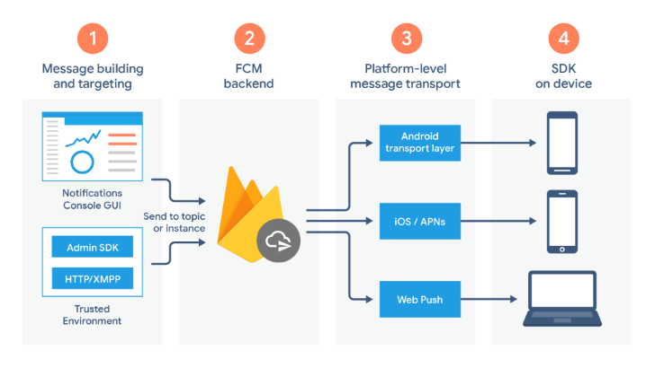

<div align="center"> 


# DESCRIZIONE DEL FUNZIONAMENTO DELLE PIATTAFORME PER LA GESTIONE DELLE PUSH NOTIFICATION PER ANDROID ED IOS
</div>

In questo documento vengono descritte le possibili soluzioni individuate per l'implementazione del sistema di notifiche push, andando a scoprire nel dettaglio i PNS.
Infine ci sarà una sezione dedicata alla piattaforma scelta e le ragioni per la quale è stata individuata come soluzione ideale per questo progetto.

Il documento è strutturato nelle seguenti sezioni:
- [Panoramica generale sui PNS](#panoramica-generale-sui-pns)
- [La soluzione individuata: Azure Notification Hubs](#la-soluzione-individuata-azure-notification-hubs)
- [Approfondimento sul processo di registrazione del dispositivo](#approfondimento-sul-processo-di-installazione-del-dispositivo)
- [Glossario](#glossario)

---

## Panoramica generale sui PNS

La mobile application Hunext Mobile è multipiattaforma e più nello specifico è indirizzata a dispositivi Android ed iOS.

Per ricevere notifiche dall'applicazione installata, la precondizione necessaria è che ogni dispositivo deve obbligatoriamente registrarsi al PNS di riferimento, instaurando un collegamento diretto ad 
esso: questa procedura viene chiamata nel gergo *PNS Handling*. 

> Questa procedura verrà approfondita nel documento *4_Descrizione-POC*.

Purtroppo non esiste uno standard unico per la gestione, la configurazione e la comunicazione con i PNS, in quanto ogni ecosistema specifico offre strumenti che svolgono la stessa funzione
ma che non sono accomunati da un'interfaccia unica. Proprio per questo motivo saranno analizzate nel dettaglio le piattaforme di notifica principali, ovvero:

- [Firebase Cloud Messaging (FCM)](#firebase-cloud-messaging-fcm) per l'ecosistema Android.
- [Apple Push Notification Service (APNS)](#apple-push-notification-service-apns) per l'ecosistema Apple.
- [Azure Notification Hubs](#azure-notification-hubs) per l'ecosistema Android, Apple e Windows.

### Firebase Cloud Messaging (FCM)

FCM è un PNS di Google che consente di inviare notifiche principalmente per i dispositivi Android. Questo servizio è comunque disponibile per i dispositivi Apple e gli applicativi Web.

La prerogativa per il funzionamento di FCM, come per ogni PNS, consiste nella registrazione dei dispositivi per la ricezione dei messaggi da FCM.
Questa procedura viene avviata da un dispositivo che, una volta installata l'applicazione, contatta FCM per ottenere un token di registrazione, il quale identifica in modo univoco l'istanza dell'applicazione
associata a quel dispositivo.
Il token di registrazione viene poi salvato nel backend di FCM, e da quel momento il dispositivo è abilitato a ricevere le notifiche.

<div align="center">
    
</div>

Il funzionamento di Firebase avviene principalmente in 4 fasi:

1) viene creata la richiesta di notifica da parte del server del provider. In un contesto reale questa responsabilità è affidata al backend aziendale, 
mentre nel contesto di questo progetto è affidata alla web application.
2) la richiesta viene passata al backend di FCM, il quale si occupa di inoltrare la richiesta ai vari livelli di trasporto.
3) la notifica viene indirizzata ai dispositivi di destinazione, applicando la configurazione della piattaforma specifica. Questo passaggio avviene
al di fuori di Firebase, nello specifico:
  - nell'Android Transport Layer (ATL) per dispositivi Android che supportano i Google Play Services.
  - nella piattaforma Apple Push Notification Service (APNS) per dispositivi iOS.
  - mediante il protocollo push Web per applicativi web.
4) i dispositivi ricevono la notifica in base allo stato attuale del dispositivo e alle configurazioni precedenti.


Il payload del messaggio è formattato in JSON (uno standard per il trasferimento di dati in rete) e può avere la dimensione massima di 4 KB, con un set di chiavi fissato da Android, con la possibilità di 
personalizzare le proprie chiavi.
Le chiavi predefinite sono:
- *token*, che è una stringa alfanumerica generata da Firebase che identifica il collegamento unidirezionale da Firebase al dispositivo.
- *notification*, che contiene le informazioni base della notifica, ovvero:
    - *title*, ovvero il titolo che appare nella notifica.
    - *body*, ovvero il messaggio che appare nella notifica.
- eccetera.

I parametri opzionali sono contenuti dentro la chiave *data*, che a sua volta contiene delle sotto-chiavi personalizzabili dall'utente. 

Inoltre è possibile inserire opzioni specifiche per ogni piattaforma che vanno a sovrascrivere le opzioni base, per esempio la priorità della notifica oppure il suo tempo di permanenza massima
nel PNS (di default 28 giorni). Le sotto-chiavi che identificano la piattaforma sono: *android*, *apns* e *webpush*.

> Per maggiori informazioni, visitare il seguente [link](https://firebase.google.com/docs/cloud-messaging/concept-options).


### Apple Push Notification Service (APNS) 

APNS è un PNS di Apple specifico in quanto consente di inviare notifiche solo ai dispositivi Apple. 

La prerogativa per il funzionamento di APNS, come per ogni PNS, consiste nella registrazione dei dispositivi per la ricezione dei messaggi da APNS.
Questa procedura viene avviata da un dispositivo Apple che, una volta avviata l'istanza dell'applicazione, contatta APNS per ricevere il token del 
dispositivo che identifica in modo univoco l'istanza dell'applicazione associata a quel dispositivo.
Il token di registrazione viene poi inoltrato al server del provider, e da quel momento il dispositivo è abilitato a ricevere le notifiche.

<div align="center"> 

</div>

Come riportato nella documentazione, la comunicazione tra il server del provider e APNS deve avvenire tramite una connessione protetta.

La creazione di tale connessione richiede l'installazione di un certificato della Certificate Authority(CA) GeoTrust sul server del provider. 
Se il server del provider non è eseguito su MacOS, è necessario installare un certificato autonomamente, possibilmente da questo 
[link](https://www.geotrust.com/resources/root-certificates/).
Per avere l'autorizzazione ad inviare le notifiche e interagire con APNS, il server del provider deve creare un certificato, che può essere il più recente
basato su token (consigliato, con estensione .p8 che utilizza HTTP/2) oppure il meno recente con estensione .p12 che utilizza TLS.

Una volta che sono stati rispettati questi prerequisiti, APNS può inviare notifiche gestendo una connessione IP crittografata e permanente al dispositivo
dell'utente, archiviando e inoltrando le notifiche per un dispositivo attualmente offline e raccogliendo notifiche con lo stesso identificatore.


Il payload del messaggio è formattato in JSON (uno standard per il trasferimento di dati in rete) ed include chiavi definite da Apple. Inoltre possono essere aggiunte
chiavi personalizzabili. 
La dimensione massima del payload è di 5 KB per le notifiche VoIP (Voice over Internet Protocol), mentre è di 4 KB per tutte le altre notifiche remote.
La chiave predefinita è *aps*, che a sua volta può contenere le seguenti sotto-chiavi:
- *alert*: indica le informazioni per la visualizzazione di una notifica. A sua volta può contenere le sotto-chiavi:
    - *title*: indica titolo della notifica.
    - *subtitle*: aggiunge informazioni aggiuntive per spiegare lo scopo della notifica.
    - *body*: indica il contenuto della notifica.
- *badge*: indica il numero da visualizzare nel badge posto sull'icona della mobile application in questione.
- eccetera.

Tutte le altre chiavi personalizzabili dall'utente possono essere aggiunte nel payload allo stesso livello gerarchico di *aps*.

> Per maggiori informazioni, visitare il seguente [link](https://developer.apple.com/documentation/usernotifications).

### Azure Notification Hubs

A differenza di FCM e APNS, Azure Notification Hubs non è un PNS bensì un broker multipiattaforma di Microsoft (o anche detto hub di notifica), che riceve dettagli di comunicazione dal server del 
provider da elaborare ed infine instradare ai PNS di riferimento. 

Notification Hubs consente di inviare notifiche a qualsiasi piattaforma da qualsiasi backend, locale o remoto che sia.
Ciò che lo differenzia da tutte le altre piattaforme è che consente di inviare messaggi a più piattaforme con una sola chiamata. 
Inoltre è Azure che si preoccupa di mantenere il registro completo di PNS handle e una serie di informazioni importanti, come i tag e i modelli associati alla registrazione di un dispositivo.

La differenza che intercorre tra il funzionamento generale dei vari PNS e Azure Notification Hubs si intuisce dal flusso della notifica push.

<div align="center"> 

</div>

Nel caso generale dei PNS, il flusso è il seguente:
1) il dispositivo contatta il PNS per la piattaforma di destinazione in cui l'applicazione è in esecuzione e richiede un PNS handle univoco e temporaneo. Come visto per FCM e APNS, il tipo di handle 
dipende dal PNS di riferimento.
2) il dispositivo archivia il PNS handle nel server del provider.
3) il backend deve inviare una notifica, quindi contatta il PNS usando il PNS handle che identifica l'applicazione del dispositivo mobile.
4) il PNS inoltra la notifica al dispositivo specificato dal PNS handle.

Come si può notare, il flusso è comune per tutte le piattaforme, ma l'implementazione del sistema di notifiche non è la stessa. 
Quindi se l'obiettivo è inviare notifiche a N piattaforme, l'implementazione della funzionalità a livello di codice avviene N volte, una per ogni servizio.

<div align="center"> 

</div>

Nel caso specifico di Azure Notification Hubs, invece, il flusso è il seguente:
1) il dispositivo contatta il PNS per la piattaforma di destinazione in cui l'applicazione è in esecuzione e richiede un PNS handle univoco e temporaneo. Come visto per FCM e APNS, il tipo di handle 
dipende dal PNS di riferimento. Questo passaggio è l'unico a rimanere intatto al flusso discusso nel caso precedente.
2) il dispositivo passa il PNS handle per il backend del provider, che poi lo inoltra all'hub di notifica che ha l'onere di archiviarlo.
3) il backend deve inviare una notifica, quindi contatta l'hub di notifica che la acquisisce e la inoltra a tutti i PNS, che a loro volta si occupano di inviarla ad utenti specifici oppure a gruppi di 
interesse.

La differenza sostanziale in questo caso d'uso specifico è l'invio automatico delle notifiche push dal server del provider: basta una chiamata all'API per inviare la notifica su tutte le piattaforme.
Quindi se l'obiettivo è inviare notifiche a N piattaforme, l'implementazione della funzionalità a livello di codice avviene con una sola chiamata.

> Per maggiori informazioni, visitare il seguente [link](https://docs.microsoft.com/it-it/previous-versions/azure/azure-services/jj927170(v=azure.100)).

<div align="right">

[Torna su](#descrizione-del-funzionamento-delle-piattaforme-per-la-gestione-delle-push-notification-per-android-ed-ios)
</div>

---

## La soluzione individuata: Azure Notification Hubs

Gestire tutti i dettagli implementativi di un PNS a livello di codice aumenta la specializzazione per una piattaforma.
D'altronde, questo lavoro diventa pesante nel momento in cui le piattaforme con la quale comunicare sono N (con N > 1). 
La responsabilità da parte dello sviluppatore aumenta ed inoltre l'invio di notifiche push richiede un'infrastruttura complessa che non è correlata alla logica di business principale dell'applicazione.

I problemi principali sono i seguenti:
- il backend richiede una logica dipendente dalla piattaforma, e la complessità aumenta con l'aumentare del numero di piattaforme da gestire.
- a causa delle linee guida, è necessario aggiornare i token di dispositivo ad ogni avvio dell'applicazione. Ciò significa che se il numero di dispositivi da raggiungere è considerevole, allora 
l'infrastruttura intera non riuscirebbe a scalare orizzontalmente il traffico che viene a generarsi.
- il backend deve mantenere un registro per salvare tutti i dispositivi ed associarli a gruppi di interesse (tag), e questo carico di lavoro aumenta i tempi di produzione e i costi di manutenzione del codice.
- monitorare e fare la telemetria di tutti i dati è assai difficile.

Per ovviare a questi problemi, è stato scelto Azure Notification Hubs anziché i PNS visti in precedenza (FCM/APNS), in quanto:
- supporta tutte le piattaforme push e la complessità delle comunicazioni con i PNS viene astratta, offrendo un'interfaccia semplice e comune.
- è compatibile con qualsiasi backend (scritto in ASP.NET Core).
- garantisce scalabilità grazie all'infrastruttura ben progettata, e quindi un invio istantaneo delle notifiche.
- i dispositivi possono essere associati a tag che rappresentano utenti o gruppi di interesse.
- ogni dispositivo può avere modelli di notifica non solo nativi della piattaforma, ma anche personalizzabili.
- forniscono un servizio di telemetria ben equipaggiato.
- infine, è uno strumento Microsoft, e quindi in linea con la suite di prodotti aziendale.

<div align="right">

[Torna su](#descrizione-del-funzionamento-delle-piattaforme-per-la-gestione-delle-push-notification-per-android-ed-ios)
</div>

---

## Approfondimento sul processo di installazione del dispositivo

Fino ad ora è stata sempre utilizzata la definizione "__registrazione__ di un dispositivo" per identificare il processo di salvataggio di una serie di informazioni necessarie ad individuare un dispositivo specifico.
Le informazioni che vengono salvate sono:
- il PNS Handle, che può essere recuperato solo a livello client.
- eventualmente i tag che vanno ad identificare gruppi di interesse.
- eventualmente i modelli di notifica personalizzati.

D'altronde lo stato dell'arte al momento della scrittura prende il nome di __installazione__, ovvero una registrazione più avanzata e moderna che consente di includere ancora più informazioni specifiche.
Oltre alle informazioni viste nel processo di registrazione, l'installazione comprende le seguenti operazioni:
- creare ed aggiornare un'installazione in modo idempotente, evitando registrazioni duplicate.
- il modello di installazione supporta un formato di tag speciale ( *$InstallationId:{INSTALLATION_ID}* ) che consente l'invio di una notifica direttamente al device specifico.
- eseguire aggiornamenti parziali delle registrazioni, alleggerendo la computazione a livello backend. 

Nel contesto specifico di Azure Notification Hubs, i processi di registrazione ed installazione sono accomunati dal fatto che l'esecuzione del processo avviene a livello backend mentre il salvataggio delle
informazioni avviene a livello di hub di notifica. Inoltre, per default, una registrazione o installazione non scade mai.

> Come conseguenza a queste osservazioni, la via percorribile scelta è il processo di installazione. Da ora in poi non verranno utilizzati altri termini.
>
> Per maggiori informazioni, consultare il seguente [link](https://docs.microsoft.com/it-it/azure/notification-hubs/notification-hubs-push-notification-registration-management#registration-management-from-a-backend).

Ora l'attenzione si focalizza sui dati che vengono recuperati sia a livello di dispositivo che a livello backend (in particolare nel layer di persistenza), per poi essere inglobati nel processo di installazione.
- **InstallationId**: identifica un dispositivo specifico associato all'applicazione dalla quale è partito il processo di installazione. Il suo utilizzo è legato soprattutto alla cancellazione dell'installazione dall'hub di notifica.
    - Questo valore può essere un GUID generato nel momento in cui viene eseguito il codice per l'installazione.
    - In Android 8.0 e superiori, il codice ```Secure.GetString(Application.Context.ContentResolver, Secure.AndroidId)``` consente di generare una stringa di 64 bit, espressa come stringa esadecimale, 
    ottenuta dalla combinazione di: chiave firmata della mobile app, utente e dispositivo. Per le restanti versioni di Android, lo stesso codice consente di generare un stringa random di 64 bit, espressa come 
    stringa esadecimale, che rimane unica nel ciclo di vita del dispositivo dell'utente.
  <p></p>

  > Il recupero di questa informazione può avvenire solo lato app.

- **Platform**: identifica la piattaforma nella quale il dispositivo si registra mediante un'apposita sigla. 
  > Il recupero di questa informazione può avvenire solo lato app.
  
- **PushChannel**: è il token recuperato dal PNS handle che identifica l'installazione di un dispositivo nella piattaforma di notifica apposita. Chiamato anche **Registration ID**, non ha alcuna associazione logica con *Registration ID* generato da Azure (vedere sotto).
  Questo parametro è strettamente legato a *Platform*, tanto che ci sono modi diversi per recuperare il token in base al sistema operativo del dispositivo.
  > Il recupero di questa informazione può avvenire solo lato app.

- **Tags**: array di etichette che identificano una serie di categorie alla quale l'utente appartiene (es. se il contesto dell'applicazione è lo sport, l'utente che tifa X e segue anche la squadra Y riceverà le notifiche sia della squadra X che della squadra Y).
  Nel caso d'uso specifico dell'applicazione *Hunext Mobile*, il tag specifico da utilizzare è il GUID utente che viene recuperato dal layer di persistenza del server aziendale. In questo modo, una notifica può essere indirizzata a specifici utenti.
  A causa dell'espressione implementata a livello backend (espressione logica con soli AND (&&)), il numero di tag possibili va da 0 a 10.
  > Per questioni di sicurezza e di elaborazione, il recupero di questa informazione avviene lato back end. In questo modo, l'utente è svincolato da ogni responsabilità, demandandola al backend.


### Come viene salvata un'installazione specifica in Azure Notification Hubs

> La precondizione necessaria per poter accertarsi di quanto viene scritto è che l'utente deve essere registrato ad un account Azure e ha già creato un hub di notifica con il
suo spazio di nomi. 
>
> I seguenti dati possono essere visualizzati in tempo reale aprendo Visual Studio 2019 e, dal menu principale, seguire il seguente percorso:
> **View -> Server Explorer -> Azure (*mailoutlook*@outlook.com) -> Notification Hubs -> *NomeNotificationHub***
> 
> Questa procedura sarà descritta nel dettaglio nel documento *4_Descrizione-POC*.

In questo momento non è ancora stato spiegato come avviene a livello di codice l'installazione, ma è importante evidenziare come vengono salvati i dati di un'installazione.
- **Platform**: identifica il tipo di piattaforma utilizzata nella registrazione mediante un'apposita sigla. 
    - GCM => Google, è l'equivalente di FCM
    - APN => Apple
    - WNS => Windows
    - MPNS => Windows Phone
    - ADM => Amazon
    - BCP => Baidu
- **Type**: indica il nome del modello salvato al momento della registrazione, ovvero il formato della notifica che si vuole inviare all'utente. Se è contrassegnato come *Native*, significa che <span style="text-decoration: underline;">non</span> è stato personalizzato e si utilizza il modello standard. 
- **Tags**: etichetta/e che identificano l'utente secondo una o più categorie di interesse. I tag non sono obbligatori, ma sono molto utili per indirizzare le notifiche a gruppi di utenti. Se non è presente alcun tag, le notifiche saranno indirizzate a tutti gli utenti registrati in Azure Notification Hubs.
- **PNS Identifier**: token che funge da identificativo per un specifico dispositivo, che viene recuperato nell'operazione di PNS handle, eseguito in prima istanza tra mobile app e la piattaforma di notifica specifica. Come descritto nella documentazione, non è garantita l'univocità. È associato al valore *PushChannel* visto sopra.
    - Per i dispositivi Android, l'identificativo è l'ID di registrazione di Firebase (*onNewToken()*).
    - Per i dispositivi Apple, l'identificativo è il token del dispositivo.
    - Per i dispositivi Windows, l'identificativo è un URI che identifica il canale. 
- **Registration ID**: ID generato automaticamente da Azure per identificare una singola registrazione.
- **Expiration date**: data di scadenza della registrazione in Azure. È impostata di default alla data 31/12/9999, in modo che la registrazione non possa mai scadere.

<div align="right">

[Torna su](#descrizione-del-funzionamento-delle-piattaforme-per-la-gestione-delle-push-notification-per-android-ed-ios)
</div>

---

## Ulteriori informazioni su Azure per l'azienda

Il servizio Azure di Microsoft offre una suite di prodotti molto ampia. Nel progetto sono stati utilizzati i servizi *Notification Hubs* e *App Service*.
I suddetti servizi sono stati utilizzati con un piano di abbonamento gratuito, sfruttando il fatto che lo stagista è studente universitario e quindi avente diritto alla gratuità del piano base.

Nel contesto aziendale va preventivato che il servizio Notification Hubs dovrà essere usufruito mediante piani di abbonamento a pagamento.
Il motivo è semplice: il piano base gratuito utilizzato durante lo stage consente al massimo solo 500 dispositivi registrati nello spazio dei nomi dell'hub di notifica, e inoltre sono consentiti al massimo
un milione di notifiche push.

> NB) Il servizio *App Service* è stato utilizzato dallo stagista per caricare il backend locale e renderlo disponibile online. Pertanto l'azienda non deve farsi carico di questo specifico servizio di Azure.

Microsoft offre gratuitamente un [calcolatore dei costi](https://azure.microsoft.com/it-it/pricing/calculator/?service=notification-hubs) che permette di capire qual'è l'abbonamento Notification Hubs più idoneo per il contesto aziendale.

Inoltre, è già disponibile al percorso *Archive/Estimate-€-Azure-Hub-Notifications.xlsx* il foglio elettronico contenente il preventivo del piano __Basic__ di *Notification Hubs* che potrebbe fare il caso dell'azienda.

> Per maggiori dettagli, visitare il seguente [link](https://azure.microsoft.com/it-it/pricing/details/notification-hubs/).

<div align="right">

[Torna su](#descrizione-del-funzionamento-delle-piattaforme-per-la-gestione-delle-push-notification-per-android-ed-ios)
</div>

---
---

### Glossario

- **Broker**: architettura di elaborazione che rende possibile la cooperazione in sistemi; in particolare, nel linguaggio di Internet, la struttura che consente a un sistema connesso in rete di mettere a
disposizione i propri servizi (informazioni e funzioni elaborative) e a sua volta di accedere a quelli degli altri sistemi.

<div align="right">

[Torna su](#descrizione-delle-tecnologie-utilizzate)
</div>
