<div align="center"> 


# DESCRIZIONE DEL PROTOTIPO SOFTWARE SVILUPPATO
</div>

L'obiettivo richiesto da parte dell'azienda è implementare un prototipo *ex novo* (chiamato *TestNotification*) per l'implementazione del sistema di notifiche push per l'applicazione mobile *Hunext Mobile*.

Prima ancora dello sviluppo del prototipo, è stato necessario configurare le piattaforme di notifica apposite. Come anticipato nel documento *1_Descrizione-generale-progetto*, non è stata
considerata la configurazione della piattaforma Apple (APNS) e tanto meno lo sviluppo specifico in *TestNotification.iOS*, ma sarà fornita la dovuta documentazione per gli sviluppatori che si faranno 
carico di integrare il prototipo nelle applicazioni aziendali.

Il prototipo comprende esattamente tre componenti, delle quali due fondamentali ai fini della realizzazione del progetto:
- un backend scritto in ASP.NET Core, con l'obiettivo di gestire le installazioni dei dispositivi e le richieste di notifica, obbligatoria ai fini del progetto.
- un'applicazione mobile scritta in Xamarin.Forms, con l'obiettivo di ricevere notifiche mirate, obbligatoria ai fini del progetto.
- una web application scritta in ASP.NET Core Razor Pages, con l'obiettivo di inviare notifiche personalizzate. Non obbligatoria ai fini del progetto, ma molto utile in quanto esegue una specifica parte 
del lavoro che dovrebbe essere in gestione del backend.

La posizione delle tre componenti nell'elenco segue l'ordine cronologico di sviluppo. Da evidenziare che backend e applicazione mobile sono le uniche componenti che hanno avuto uno sviluppo parallelo, 
rappresentando quasi il 90% del tempo di sviluppo del prototipo. La web application è stata sviluppata dopo la conclusione di queste due componenti e ha rappresentato il restante 10%.

Il documento è strutturato nelle seguenti sezioni:
- [Configurazione di Firebase ed Azure Notification Hubs](#configurazione-di-firebase-ed-azure-notification-hubs)
- [Sviluppo backend](#sviluppo-backend)
- [Sviluppo applicazione mobile](#sviluppo-applicazione-mobile)
- [Sviluppo web application](#sviluppo-web-application)

> Alcune parti del progetto sono state riutilizzate dal tutorial presente al seguente [link](https://docs.microsoft.com/it-it/azure/developer/mobile-apps/notification-hubs-backend-service-xamarin-forms).

---

## Configurazione di Firebase ed Azure Notification Hubs

Prima di iniziare, è necessario accertarsi di avere un account Google e una sottoscrizione in [Azure](https://portal.azure.com/). Una volta effettuati gli accertamenti del caso, il primo passo è inizializzare la configurazione di Firebase Cloud Messaging (FCM). 

Ecco la sequenza di azioni da effettuare:
1) accedere alla [console di Firebase](https://firebase.google.com/console/), cliccare su *Aggiungi progetto* e inserire il nome del progetto che deve essere univoco (in questo caso è *TestPushNotification*).
2) una volta effettuata la creazione del progetto, selezionare *Aggiungi Firebase alla tua app Android* e si aprirà una pagina con un form da compilare.
    - in *Nome pacchetto Android* inserire un nome per il pacchetto (in questo caso è *com.hunext.testnotification*) e clicca il bottone *Registra app*.
    - cliccare il bottone *Scarica google-services.json.* e copiarlo in locale: successivamente, verrà copiato in *TestNotification.Android*. Cliccare il bottone *Avanti*.
    - infine cliccare il bottone *Vai alla console*.
3) sulla tendina a sinistra, andare sulle impostazioni di *Panoramica del progetto* e selezionare la voce *Impostazioni progetto*.
    - passare alla scheda *Cloud Messaging* e cercare in *Credenziali di progetto* il valore di *Chiave server*. A questo punto, copiare il token e salvarlo in un file per utilizzarlo successivamente.

<div align="center">
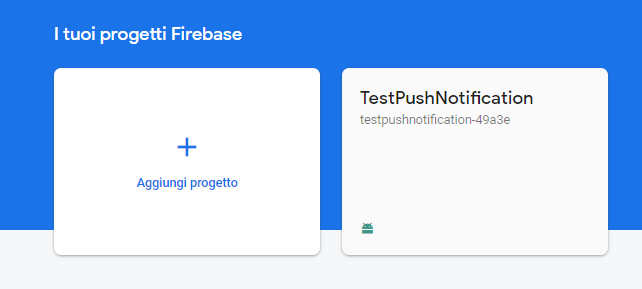
</div>

Una volta configurato le varie piattaforme, il passo successivo è creare un hub di notifica in Azure. 

Ecco la sequenza di azioni da effettuare:
1) accedere ad [Azure](https://portal.azure.com/).
2) dalla pagina principale, sotto la voce *Servizi di Azure* selezionare la voce *Crea una risorsa*. 
    - una volta che la pagina è aperta, digitare sulla barra di ricerca *Notification Hub*, selezionarlo e cliccare sul pulsante *Crea*.
3) inserire tutti i campi richiesti per creare correttamente il nuovo hub di notifica.
    - *Sottoscrizione*: scegliere la sottoscrizione di destinazione dall'elenco a discesa.
    - *Gruppo di risorse*: creare un nuovo gruppo di risorse o selezionarne uno esistente.
    - *Spazio dei nomi di Hub di notifica*: inserire un nome univoco globale (__nuovo__) per lo spazio dei nomi, o *namespace*, di *Hub di notifica*.
    - *Hub di notifica*: inserire un nome per il nuovo hub di notifica.
    - *Località*: scegliere la zona desiderabile per localizzare il server dall'elenco a discesa.
    - *Piano tariffario*: scegliere il tipo di piano tra gratuito, basic e standard. In questo progetto è stato selezionata la voce *gratuito*.
4) confermare la creazione della risorsa.
5) dalla pagina principale, selezionare l'hub di notifica appena creato.
    - selezionare dal menu della risorsa la voce *Access Policies*.
        - salvare in un file le due *Connection String* inerenti alle *Policy Name*: *DefaultListenSharedAccessSignature* e *DefaultFullSharedAccessSignature*.
6) configurare l'hub di notifica con le informazioni di FCM.
    - selezionare dal menu della risorsa la voce *Google (GCM/FCM)*.
    - inserire la *Chiave server* che è stata copiata nell'ultimo passo nella console di Firebase.
    - cliccare il pulsante *Save*.

<div align="center">
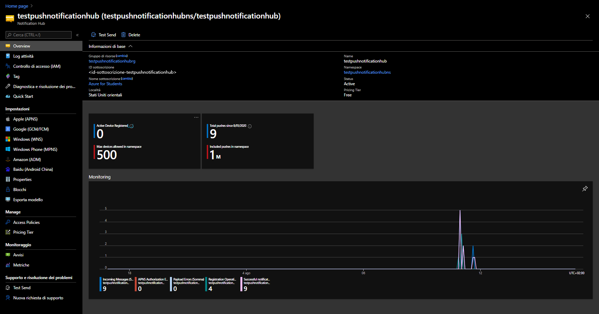
</div>
<p></p>

> Per configurare Apple Push Notification Services (APNS) e l'hub di notifica in Azure con le informazioni di APNS, visitare la seguente [sezione](https://docs.microsoft.com/it-it/azure/developer/mobile-apps/notification-hubs-backend-service-xamarin-forms#set-up-push-notification-services-and-azure-notification-hub).

A questo punto, l'hub di notifica e i PNS sono configurati correttamente e possono svolgere la loro funzione.
Il prossimo passo è lo sviluppo del codice, a partire dal backend.

<div align="right">

[Torna su](#descrizione-del-prototipo-software-sviluppato)
</div>

---

## Sviluppo backend

Il progetto *TestNotification.Backend* è stato sviluppato a partire da un progetto ASP.NET Core Web API, con il framework .NET Core 3.1, supportando il design pattern della
*Dependency Injection (DI)*.

Il backend è una parte fondamentale di questo progetto in quanto gestisce le chiamate per la gestione delle installazioni dei dispositivi e le richieste di
invio notifiche destinate all'hub di notifica di Azure, che a sua volta gestirà autonomamente l'invio delle notifiche ai PNS di riferimento.

La sezione è strutturata nelle seguenti sotto-sezioni:
- [Le parti principali del codice TestNotificationBackend](#le-parti-principali-del-codice-testnotificationbackend)
- [Attività facoltative](#attivita-facoltative)

### Le parti principali del codice TestNotificationBackend

Il primo passaggio essenziale per lo sviluppatore è inserire valori di configurazione localmente utilizzando lo strumento *Secret Manager*. 
Assicurandosi di essere all'interno della cartella *TestNotificationBackend*, aprire il terminale ed inserire i seguenti comandi:

```
dotnet user-secrets init
dotnet user-secrets set "NotificationHub:Name" <value>
dotnet user-secrets set "NotificationHub:ConnectionString" <value>
```

Il placeholder *\<value\>* va rimpiazzato in questo modo:
- **NotificationHub:Name** è la voce *Name** che si trova in *Informazioni di base* nella pagina principale dell'hub di notifica appena creato.
- **NotificationHub:ConnectionString** è il valore *DefaultFullSharedAccessSignature* copiato nel passaggio 5) della creazione dell'hub di notifica per l'accesso in lettura e scrittura ad Azure.

Il passaggio successivo è aggiungere le dipendenze necessarie al backend dal servizio *NuGet* di Visual Studio:
- *Microsoft.Azure.NotificationHubs*, la libreria che permette di effettuare specifiche chiamate ad Azure Notification Hubs.
- *LiteDB*, la libreria che permette di creare e gestire un database locale NoSQL. 

Da questo momento, è importante analizzare le tappe cruciali per la realizzazione del backend.
Il progetto è strutturato in questa sequenza:
- *Properties*, la cartella che contiene tutti i parametri per avviare il backend e i file contenenti un riferimento con lo strumento *Secret Manager*.
- *Controllers*, la cartella che contiene le classi responsabili della logica di controllo, in particolare
    - in *LoginController* viene gestito un unico endpoint per l'accesso autenticato degli utenti dall'applicazione mobile.
    - in *NotificationsController* vengono gestiti gli endpoint per l'installazione dei dispositivi, la cancellazione della medesima e l'invio delle notifiche.
- *Models*, la cartella che contiene tutte le classi con la logica di business e di convalida.
- *Services*, la cartella che contiene tutti i servizi che vengono richiamati dal controller, responsabili delle chiamate alle librerie di progetto.

Prima di spiegare le parti più importanti e significative del codice, va fatto un piccolo appunto sul layer di persistenza del backend.
L'utilizzo di LiteDB è fondamentale per simulare le dinamiche del backend aziendale, dove molte informazioni vengono carpite dal database aziendale.
Nel caso di questo progetto il database non ha bisogno di implementazione (essendo NoSQL) ed è talmente leggero che non va a gravare sulle prestazioni del backend.
Viene utilizzato prevalentemente per due motivi:
- per l'autenticazione degli utenti dall'applicazione mobile nella procedura di login.
- una volta che l'utente è autorizzato, si vogliono ottenere dati utili per l'installazione del dispositivo e per la visualizzazione di dati utente nella parte autorizzata 
dell'applicazione mobile.


Ora che è stata fatta chiarezza sull'utilizzo del database, si può passare l'attenzione alle classi più importanti del backend.

**1) DeviceInstallation.cs**

Questa classe contiene i dati, tutti obbligatori, che sono gestiti e devono essere spediti dall'applicazione mobile dopo il recupero del PNS handle:
- **InstallationId**.
- **Platform**.
- **PushChannel**.

> Per capire il significato di questi dati, andare a vedere la sezione *Approfondimento sul processo di installazione del dispositivo* nel documento *3_Descrizione-funzionamento-piattaforme-notifiche-push*.

Un altro dato che servirà nel processo di installazione del dispositivo è **Tags**, un vettore nel quale verrà salvato il GUID dell'utente che ha effettuato il login, in modo da 
poter indirizzare le richieste ad un utente specifico come richiesto dal tutor aziendale. Lo stesso dato viene utilizzato per essere inserito nell'header delle richieste HTTP(S) 
per certificare che le richieste effettuate dall'applicazione mobile siano autenticate.

> **Tags** verrà inserito nella classe *NotificationsController* all'endpoint PUT *~/installations*, dopo aver fatto la verifica che la chiamata sia autorizzata.

**2) PushTemplates.cs**

Questa classe contiene i payload di notifica nel formato stringa (pronto per essere serializzato in formato JSON) sia per dispositivi Android che per iOS. 
All'interno sono presenti due classi interne:
- *Generic*, che rappresenta la notifica classica che viene ricevuta da tutti i dispositivi. È l'unica classe utilizzata in questo prototipo.
- *Silent*, che rappresenta una notifica silenziosa, ovvero non invasiva a livello visivo in quanto presente solo nel caso in cui l'utente scrolli la tendina delle notifiche. Solitamente è utilizzata per
segnalare servizi attivi in background, come per esempio la navigazione su Google Maps. Non è utile ai fini del progetto, ma se nel futuro l'azienda volesse utilizzare questo tipo di notifica
l'implementazione sarebbe quasi immediata.

*Payload generico Android:*
```
{ 
    "notification": 
    { 
        "title" : "TestNotification", 
        "body" : "$(alertMessage)"
    }
}"
```

*Payload generico iOS:*
```
{ 
    "aps" : 
    {
        "alert" : "$(alertMessage)"
    } 
}
```

Il placeholder *$(alertMessage)* verrà sostituito in *NotificatioHubsService.cs* con il metodo seguente:
```
string PrepareNotificationPayload(string template, string text) => template
    .Replace("$(alertMessage)", text, StringComparison.InvariantCulture); 
```

Utilizzando questo payload non viene registrato alcun modello di notifica, in quanto quello utilizzato è un modello che, nel gergo tecnico, viene chiamato *nativo*.
Per l'installazione del dispositivo è comunque prevista la registrazione di modelli personalizzati, inserendo ulteriori chiavi come analizzato nel documento *3_Descrizione-funzionamento-piattaforme-notifiche-push*.

**3) NotificationRequest.cs**

Questa classe contiene i dati che vengono passati all'invio della notifica (nel caso di questo progetto dalla web application) e rimpiazzano i placeholder nei payload di 
notifica. Nello specifico *Text* va a sostituire $(alertMessage), mentre *Tags* viene elaborato e poi inserito come parametro nella chiamata all'API di Azure Notification Hubs 
che si occupa nello specifico di inviare notifiche con una specifica *tagExpression*.

> La classe *NotificationRequestTemplate.cs* non è stata implementata, ma sarà pronta all'uso nel momento in cui gli sviluppatori implementeranno la logica di invio delle notifiche dal backend anziché 
dalla web application.
 
**4) NotificationsController.cs**

Qui risiede il fulcro della Web API RESTful: infatti questa classe funge un ruolo fondamentale per la comunicazione e la gestione delle richieste tra i dispositivi e il backend stesso.
Grazie all'inserimento in cima alla classe dell'attributo *[ApiController]*, viene abilitato il routing delle richieste a specifici endpoint e le risposte HTTP sono automatiche.

Gli endpoint che possono essere accettati dal backend sono i seguenti:
- GET *~/api/notifications/users/all*: ritorna una risposta HTTP 200 con annesso oggetto che contiene tutti gli id utente con annesso username. Necessario per creare dinamicamente la tendina selezionabile della web 
application per l'invio di notifiche mirate ad utenti precisi.
- PUT *~/api/notifications/installations*: ritorna una risposta HTTP 200 con i tag del dispositivo se la creazione dell'installazione di un dispositivo o il suo conseguente aggiornamento avviene con successo.
- DELETE *~/api/notifications/installations/\{installationId}*: ritorna una risposta HTTP 200 se la cancellazione dell'installazione del dispositivo specificato dal parametro *installationId* avviene con 
successo. 
- POST *~/api/notifications/requests*: ritorna una risposta HTTP 200 se la richiesta di invio della notifica è andata a buon fine.

**5) NotificationHubsService.cs**

In questa classe sono presenti i metodi che sono stati richiamati dagli endpoint di *NotificationsController*. In particolare la logica è incentrata sulle operazioni da effettuare con Azure, infatti è
alto l'utilizzo dell'API di Azure Notification Hubs.

I metodi principali sono i seguenti:
- *CreateOrUpdateInstallationAsync(DeviceInstallation deviceInstallation, CancellationToken token, string[] tags)*: chiamato dal codice dell'endpoint PUT *~/api/notifications/installations*, viene prima 
creato l'oggetto *Installation* che contiene tutti i dati di *DeviceInstallation* e il vettore stringa *tags*, ed infine effettua una chiamata all'API con 
*_hub.CreateOrUpdateInstallationAsync(installation, token)* per creare oppure aggiornare l'installazione del dispositivo. Se la chiamata va a buon fine, il metodo ritorna il tag salvato nel processo di 
installazione (ovvero l'id utente) che servirà successivamente all'applicazione mobile per essere aggiunto nell'header di specifiche richieste HTTP ed essere gestito come "token" per l'autorizzazione.
- *DeleteInstallationByIdAsync(string installationId, CancellationToken token)*: chiamato dal codice dell'endpoint DELETE *~/api/notifications/installations/\{installationId}*, procede alla cancellazione di 
una specifica installazione (il parametro *installationId*) effettuando una chiamata all'API con * _hub.DeleteInstallationAsync(installationId, token)*. Ritorna true se la cancellazione è andata a buon fine.
- *RequestNotificationAsync(NotificationRequest notificationRequest, CancellationToken token)*: chiamato dal codice dell'endpoint POST *~/api/notifications/requests*, viene prima elaborato  l'oggetto 
*NotificationRequest* per preparare il payload di notifica, sia per Android che per iOS, e l'espressione logica di tag (*tagExpression*) per indirizzare la notifica a categorie di utenti specifici (in questo caso all'id
di uno specifico utente). 
    - Se non sono presenti tag viene richiamato il metodo *SendPlatformNotificationsAsync(androidPayload, iOSPayload, token)* che inoltra la notifica in modalità broadcast, 
    - altrimenti viene fissato un limite massimo di 10 tag (perché l'espressione logica contiene solo operatori logici AND (&&)) e viene richiamato il metodo 
    *SendPlatformNotificationsAsync(androidPayload, iOSPayload, tagExpression.ToString(), token)* per inviare notifiche mirate grazie all'inserimento del parametro *tagExpression()*.
    
    I seguenti metodi sono responsabili delle chiamate all'API come si può vedere dal seguente codice:
    ```
    Task SendPlatformNotificationsAsync(string androidPayload, string iOSPayload, CancellationToken token)
    {
        var sendTasks = new Task[]
        {
            _hub.SendFcmNativeNotificationAsync(androidPayload, token),
            _hub.SendAppleNativeNotificationAsync(iOSPayload, token)
        };

        return Task.WhenAll(sendTasks);
    }

    Task SendPlatformNotificationsAsync(string androidPayload, string iOSPayload, string tagExpression, CancellationToken token)
    {
        var sendTasks = new Task[]
        {
            _hub.SendFcmNativeNotificationAsync(androidPayload, tagExpression, token),
            _hub.SendAppleNativeNotificationAsync(iOSPayload, tagExpression, token)
        };

        return Task.WhenAll(sendTasks);
    }
    ```

    Il vantaggio che si trae da questi metodi è la gestione contemporanea dell'invio delle notifiche con un modello di notifiche nativo a più piattaforme, in questo caso specifico ad FCM e APNS.

**6) LoginController.cs**

Come *NotificationsController*, questa classe è abilitata a ricevere richieste da determinati endpoint grazie alla presenza dell'attributo *[ApiController]*.
Questa classe è stata creata appositamente per separare le operazioni che coinvolgono le chiamate all'API di Azure Notifications Hubs dalle operazioni che interessano l'autenticazione dell'utente.

In questo caso l'endpoint presente è solo uno:
- POST *~/login*: ritorna una risposta HTTP 200 con l'annesso oggetto di risposta *LoginResponse* se le credenziali contenute nel corpo della richiesta sono presenti all'interno del database di LiteDB.

**7) UserManagerService.cs**

In questa classe sono presenti metodi che, in base al loro scopo, vengono utilizzati sia da *LoginController* che da *NotificationsController*. In particolare vengono gestite tutte le operazioni con 
LiteDB.

I metodi principali sono i seguenti:
- *GetAllUsers()*: ritorna la lista di tutti gli utenti, in particolare gli id associati agli username. Viene utilizzato nel codice dell'endpoint GET *~/api/notifications/users/all*
- *GetUserByUsername(string username)*: ritorna un utente in base allo username passato come parametro del metodo. Viene utilizzato nel codice dell'endpoint POST *~/login*.
- *GetUserById(Guid id)*: ritorna un utente in base all'id passato come parametro del metodo. Viene utilizzato nel codice degli endpoint PUT *~/api/notifications/installations* e 
DELETE *~/api/notifications/installations/\{installationId}* per accertarsi che la richiesta HTTP sia autorizzata, verificando che nell'header sia presente l'id utente.
- *AuthenticateUser(string username, string password)*: ritorna true se le credenziali dell'utente sono presenti nel database. Viene utilizzato nel codice dell'endpoint POST *~/login*.

<div align="right">

[Torna su](#descrizione-del-prototipo-software-sviluppato)
</div>

### Attività facoltative

#### Creazione dell'App Service su Azure

In questo progetto è risultato necessario creare un'API Application nel servizio di Azure *App Service* per ospitare il backend e averlo a disposizione in rete in qualsiasi momento.
Ovviamente ai fini dell'azienda questo passaggio è inutile in quanto il backend aziendale è già ospitato in altri servizi di hosting.

Nonostante questa premessa, si vuole mostrare quali misure ha adottato lo stagista per sopperire a questo problema.
Di seguito vengono elencati in sequenza i passaggi da effettuare per attivare questo servizio:
1) Se si è già registrati, accedere ad [Azure](https://portal.azure.com/).
2) Dalla pagina principale, sotto la voce *Servizi di Azure* selezionare la voce *Crea una risorsa*.
    - nella barra di ricerca digitare *API App*, selezionare il risultato ottenuto e cliccare il bottone *Crea*.
3) Inserire i dati nei rispettivi campi:
    - **Nome app**: inserire un nome univo che identifica l'API App.
    - **Sottoscrizione**: selezionare la stessa sottoscrizione scelta durante la creazione dell'hub di notifica.
    - **Gruppo di risorse**: selezionare lo stesso gruppo di risorse scelta durante la creazione dell'hub di notifica.
    - **Località**: scegliere la zona desiderabile per localizzare il server dall'elenco a discesa.
    - **Application Insights:**: lasciare le opzioni suggerite da Azure.
4) Una volta inserito i dati del punto 3), confermare la creazione del servizio ed entrare all'interno della risorsa.
5) Salvare in un file a parte l'URL *https://<app_name>.azurewebsites.net* che si trova in *Informazioni di base*, in quanto verrà utilizzato nell'applicazione mobile.
6) Selezionare dal menu della risorsa la voce *Configurazione*.
    - cliccare sul pulsante *Nuova impostazione applicazione* ed inserire le seguenti chiavi con gli annessi valori (salvati in precedenza):
        - *NotificationHub:Name*.
        - *NotificationHub:ConnectionString*.
    - cliccare sul bottone *Salva* e poi su *Continua*.

#### Pubblicare il backend

Questa attività è strettamente legata alla creazione dell'App Service su Azure descritta nel paragrafo precedente, e viene svolta dall'ambiente di sviluppo Visual Studio 2019.

Per distribuire il backend e renderlo pubblico su Azure, seguire in sequenza i seguenti passaggi:
1) cambiare la configurazione del progetto da *Debug* a *Release*.
2) fare click destro sul progetto *TestNotificationBackend*.
3) Selezionare la voce *Publish*,
    - selezionare *Azure* come target.
    - selezionare *Azure App Service (Windows)* come target specifico.
    - connettersi all'account di Azure se non è già stato fatto.
    - selezionare il gruppo di risorse alla quale appartiene l'App Service creata precedentemente.
    - infine selezionare il pulsante *Finish*.

#### Note a margine

L'utilizzo del backend può essere sia locale che remoto. Lo stagista ha preferito creare un App Service in modo da poter testare in una modo più fedele alla realtà il funzionamento dell'applicazione 
mobile e dell'intera infrastruttura. D'altro canto Azure non offre strumenti di debug del backend caricato, quindi l'utilizzo del backend in locale si è rivelato molto utile per poter fare debugging 
in profondità per rilevare e risolvere i problemi del codice backend.

Di default il backend funziona solo su Azure. Nel caso lo sviluppatore sia interessato a farlo funzionare in locale, cambiare le configurazioni nel file *Program.cs* e cambiare l'indirizzo del server 
nell'applicazione mobile.

<div align="right">

[Torna su](#descrizione-del-prototipo-software-sviluppato)
</div>

---

## Sviluppo applicazione mobile

Il progetto *TestNotification* è stato sviluppato a partire da un progetto Xamarin.Forms nella quale sono state selezionate le destinazioni Android e iOS.
A fronte di ciò, il progetto che viene generato è composto da tre parti:
- *TestNotification*, che contiene parte di codice condivisa e comune sia ad Android che iOS.
- *TestNotification.Android*, che contiene la parte specializzata di Android.
- *TestNotification.iOS*, che contiene la parte specializzata di iOS.

> La parte inerente a *TestNotification.iOS* non verrà modificata per i motivi citati nei precedenti documenti. All'azienda verrà fornita la relativa documentazione.

L'applicazione mobile è la parte obbligatoria da sviluppare nel frontend ed è il componente fondamentale per testare la ricezione di notifiche da parte della web application (nel contesto aziendale sarà
dal backend). Le notifiche sono push, quindi la visualizzazione avviene sia in primo piano (notifiche *heads-up*) che nel centro notifiche, e in qualsiasi stato si trovi il dispositivo, con la prerogativa
che esso sia connesso alla rete. In caso contrario, solo una volta che viene riattivata la rete allora il dispositivo sarà in grado di ricevere tutte le notifiche che sono rimaste accodate nei PNS di 
riferimento.

La struttura dell'applicazione mobile è divisa in due parti. 
Nella prima parte l'utente accede per la prima volta all'applicazione e deve inserire le proprie credenziali mediante l'apposito form di login. 
Se le credenziali sono corrette, a livello di codice avviene l'installazione del dispositivo nell'hub di notifica e poi si viene reindirizzati ad una pagina che mostra alcune informazioni personali 
ricavate dal database del backend. 
Questo passaggio è fondamentale ai fini della dimostrazione del funzionamento delle notifiche push, in quanto solo se l'utente è autenticato all'app è interessato a ricevere le notifiche, 
ed è ciò che avviene realmente.
Nella pagina è presente un pulsante di logout che ha il compito di disconnettere l'utente e cancellare l'installazione del dispositivo dall'hub di notifica. 
Alla fine di questo passaggio l'utente è reindirizzato alla pagina iniziale di login e viene dimostrato che a questo punto non vengono più recapitate notifiche al dispositivo.

La sezione è strutturata nelle seguenti sotto-sezioni:
- [Le parti principali del codice TestNotification](#le-parti-principali-del-codice-testnotification)
- [Le parti principali del codice TestNotification.Android](#le-parti-principali-del-codice-testnotification.android)
- [Manuale utente TestNotification](#manuale-utente-testnotification)
- [Sviluppo di TestNotification.iOS](#sviluppo-di-testnotification.ios)


### Le parti principali del codice TestNotification

Il primo passaggio necessario per il corretto funzionamento è aggiungere le dipendenze necessarie all'applicazione mobile dal servizio *NuGet* di Visual Studio:
- *Newtonsoft.Json*, la libreria che permette di gestire il codice JSON.

Il secondo passaggio è creare una classe *Config.cs* che ha il compito di mantenere tutti i valori segreti fuori dal controllo del codice sorgente
Il codice è il seguente:
```
public static partial class Config
{
    public static string BackendServiceEndpoint = "BACKEND_SERVICE_ENDPOINT";
}
```

Il valore *BACKEND_SERVICE_ENDPOINT* verrà sostituito da un'altra nuova classe *Config.local_secrets.cs* che non dovrà mai essere pubblicata in rete (controllare il file .gitignore) e quindi 
rimanere in locale.
Il codice è il seguente:
```
public static partial class Config
{
    static Config()
    {
        // Uncomment ONLY one BackendServiceEndpoint string to start back end

        // Use this string connection if the back end works on Web Service Azure, because it is loaded there 
        //BackendServiceEndpoint = "<your_api_app_url>";

        /* RECOMMENDED FOR DEBUG --> deactivate the firewall completely!
         * 
         * Use this string connection if your back end works on localhost 
         * http(s)://<your-local-ipv4-address>:<service-port>
         */
        //BackendServiceEndpoint = "http(s)://<your-local-ipv4-address>:<service-port>";
    }
}
```

Se il servizio backend è istanziato nell'App Service di Azure, allora de-commentare la riga *BackendServiceEndpoint = "<your_api_app_url>";* e sostituire il placeholder con l'URL dell'App Service 
salvata precedentemente su un file a parte.
Nel caso contrario in cui il servizio backend sia locale, de-commentare la riga *BackendServiceEndpoint = "http(s)://\<your-local-ipv4-address>:\<service-port>";* e sostituire il placeholder con
l'indirizzo locale del nodo nella quale il server è in funzione nella rete interna e la porta per accedere al servizio.

Da questo momento, è importante analizzare le tappe cruciali per la realizzazione dell'applicazione mobile.
Il progetto è strutturato in questa sequenza:
- *Models*, la cartella che contiene tutte le classi con la logica di business e di convalida.
- *Services*, la cartella che contiene tutte le classi che si occupano di costruire richieste HTTP da inviare al backend.
- *AuthorizedUserPage.xaml*, il file che contiene il codice inerente all'activity nella quale l'utente ha accesso solo dopo aver inserito correttamente le credenziali.
- *LoginPage.xaml*, il file che contiene il codice inerente l'activity principale con il form di login.

Ora l'attenzione passa sulla focalizzazione delle classi più significative di TestNotification.

**1) DeviceInstallation.cs**

Questa classe è analoga all'omonima classe presente nel codice backend, con l'unica differenza che ogni variabile è associata alla proprietà *JsonProperty*.

> Tutte le classi di *Models* associano la proprietà *JsonProperty* alle variabili interne, per la corretta serializzazione degli oggetti generati che verranno inseriti nelle chiamate HTTP.

Va evidenziato il fatto che in questa classe sono presenti solo le informazioni minime che devono essere gestite obbligatoriamente dal dispositivo.
La responsabilità di ricavare i tag appartiene al backend in quanto è meno vulnerabile rispetto ad un'applicazione mobile e rende le operazioni più veloci offrendo un'esperienza utente migliore.

**2) NotificationRegistrationService**

Questa classe contiene tutti i metodi che corrispondono alle richieste che il dispositivo può inoltrare al backend. In particolare, sono presenti i metodi per la gestione dell'installazione del 
dispositivo.

I metodi principali sono i seguenti:
- *RegisterDeviceAsync()*: si occupa di prelevare tutti i dati per l'installazione del dispositivo (che vengono recapitati da TestNotification.Android oppure TestNotification.Apple) per poi essere
inviati nella specifica richiesta HTTP. Se la procedura va a buon fine, il dispositivo riceverà come risposta i tag, che successivamente verranno salvati segretamente al pari del token che 
rappresenta il PNS handle.
- *RefreshRegistrationAsync()*: si occupa di aggiornare l'installazione del dispositivo se ancora presente nell'hub di notifica di Azure. Se il PNS handle e i tag sono presenti nella memoria segreta locale
e il token del PNS handle è diverso dal token appena recapitato dal PNS, allora viene richiamato nuovamente il metodo *RegisterDeviceAsync()*, altrimenti l'aggiornamento non viene effettuato in quanto
non necessario.
- *DeregisterDeviceAsync()*: si occupa di cancellare l'installazione del dispositivo. Se la procedura va a buon fine, il dispositivo cancellerà i segreti che erano stati salvati a partire dalla 
procedura di installazione.

Ogni chiamata HTTP viene costruita a partire dal metodo *SendAsync\<T\>(HttpMethod requestType, string requestUri, T obj)*, che ha il compito di inserire nell'header la chiave *User-Id* che corrisponde
all'id dell'utente che fa la richiesta, che a sua volta è anche il tag salvato nell'installazione del dispositivo nell'hub di notifica; inoltre viene costruito il *content* della richiesta che corrisponde
ai parametri che vengono ricevuti nei metodi corrispondenti agli endpoint descritti nel backend. Infine ritorna il codice della risposta HTTP.

Di seguito viene illustrato il codice:
```
private async Task<HttpResponseMessage> SendAsync<T>(HttpMethod requestType, string requestUri, T obj)
{
    if (!_client.DefaultRequestHeaders.Contains("User-Id"))
    {
        // Add token authentication on header HTTP(S) request
        var tokenAuthentication = await SecureStorage.GetAsync(App.TokenAuthenticationKey);
        _client.DefaultRequestHeaders.Add("User-Id", tokenAuthentication);
    }

    var request = new HttpRequestMessage(requestType, new Uri($"{_baseApiUrl}{requestUri}"));

    if (obj != null)
    {
        string serializedContent = null;
        await Task.Run(() => serializedContent = JsonConvert.SerializeObject(obj)).ConfigureAwait(false);
        if (serializedContent != null)
            request.Content = new StringContent(serializedContent, Encoding.UTF8, "application/json");
    }

    return await _client.SendAsync(request).ConfigureAwait(false);
}
```

**3) LoginService.cs**

Questa classe contiene l'unico metodo utile per inoltrare la richiesta di autenticazione al backend, che è il seguente:
- *Login(string username, string password)*: questo metodo si occupa di costruire la richiesta HTTP con il *content* che corrisponde all'oggetto *LoginRequest*. Una volta che la 
richiesta viene inoltrata, si aspetta la risposta che corrisponde all'oggetto *LoginResponse* che, in caso di esito positivo, verrà inoltrata al metodo 
*OnLoginButtonClicked(object sender, EventArgs e)* della classe *LoginPage.xaml.cs* che salverà nei segreti locali sia l'id dell'utente che i dati restanti che serviranno per la 
seconda activity.

**4) LoginPage.xaml.cs**

Questa classe contiene tutta la logica della pagina *LoginPage* che corrisponde alla prima activity che contiene il form di login.

> La grafica della pagina *LoginPage* viene codificata con il linguaggio XAML e risiede nel file *LoginPage.xaml*.

L'evento più significativo avviene quando viene premuto il pulsante di login e avviene sia la procedura di login che quella di installazione del dispositivo.
Il procedimento è il seguente: se i campi del form sono stati compilati, allora viene richiamato il metodo *Login(usernameEntry.Text, passwordEntry.Text)*. 
Se tutto va a buon fine, allora viene salvato nei segreti locali l'id utente e viene richiamato il metodo della medesima classe *RegistrationDevice()*. 
A questo punto viene invocato in modo asincrono il metodo *RegisterDeviceAsync()* della classe *NotificationRegistrationService*: se il task va a buon fine allora l'utente verrà indirizzato 
nell'activity successiva *AuthorizedUserPage*.

> In caso di successo, l'ultima operazione è il salvataggio di *Username*, *Company* e *SectorCompany* nel segreto locale di *App.CachedDataAuthorizedUserKey*. Se ancora presenti localmente, questi dati 
vengono recuperati all'avvio dell'applicazione insieme all'activity *AuthorizedUserPage*. Questa operazione è fondamentale per salvare la sessione utente attuale, altrimenti l'applicazione ripartirebbe
da zero e richiederebbe un altro login, cosa che non deve succedere se un utente è già autenticato oppure non ha fatto richiesta di disconnessione dal servizio.
>
> Il codice è consultabile in *App.xaml.cs*.

Ora l'utente può ricevere notifiche dall'applicazione mobile TestNotification fino a quando non viene avviata la procedura di logout e questa avvenga con esito positivo.

Di seguito viene illustrato il codice:
```
async void OnLoginButtonClicked(object sender, EventArgs e)
{
    if (usernameEntry.Text != null && passwordEntry.Text != null)
    {
        loginButton.IsVisible = resetButton.IsVisible = false;
        loginActivityIndicator.IsRunning = true;
        try
        {
            var result = await _loginService.Login(usernameEntry.Text, passwordEntry.Text);

            // Save locally "token" authentication to save on every header HTTP request
            await SecureStorage.SetAsync(App.TokenAuthenticationKey, result.Id.ToString());
            RegistrationDevice();

            loginActivityIndicator.IsRunning = false;
            await Navigation.PushAsync(new AuthorizedUserPage(result.Username, result.Company, result.SectorCompany));
            loginButton.IsVisible = resetButton.IsVisible = true;
            Toast.MakeText(Android.App.Application.Context, "Successful login: device registered.", ToastLength.Short).Show();

            // This block needs to recover AuthorizedUserPage activity, when the app is closed but the user has logged in yet
            string[] userDataAuthorized = { result.Username, result.Company, result.SectorCompany };
            await SecureStorage.SetAsync(App.CachedDataAuthorizedUserKey, JsonConvert.SerializeObject(userDataAuthorized));
        }
        catch (Exception ex)
        {
            loginActivityIndicator.IsRunning = false;
            loginButton.IsVisible = resetButton.IsVisible = true;
            Console.WriteLine($"Exception: {ex.Message}");
            Toast.MakeText(Android.App.Application.Context, "Login error: inserted fields not right.", ToastLength.Long).Show();
        }
    }
    else
        Toast.MakeText(Android.App.Application.Context, "Please, complete all the fields.", ToastLength.Long).Show();
}

async void RegistrationDevice()
{
    await _notificationRegistrationService.RegisterDeviceAsync().ContinueWith(async (task)
                            =>
    {
        if (task.IsFaulted)
        {
            Console.WriteLine($"Exception: {task.Exception.Message}");
            await Navigation.PushAsync(new LoginPage());
            Toast.MakeText(Android.App.Application.Context, "Error during device registration: retry to log in.", ToastLength.Long).Show();
        }
        else
            Console.WriteLine("Device registered: now is available to receive push notification.");
    });
}
```

**5) *AuthorizedUserPage.xaml.cs*

Questa classe contiene tutta la logica della pagina *AuthorizedUserPage* che corrisponde alla seconda activity che contiene le informazioni dell'utente autenticato in TestNotification.

> La grafica della pagina *AuthorizedUserPage* viene codificata con il linguaggio XAML e risiede nel file *AuthorizedUserPage.xaml*. 

L'evento più significativo avviene quando viene premuto il pulsante di logout e avviene sia la procedura di logout che quella di cancellazione dell'installazione del dispositivo.
Il procedimento è il seguente: viene invocato il metodo della medesima classe *DeregistrationDevice()*, che invoca il metodo *DeregisterDeviceAsync()* della classe *NotificationRegistrationService*:
se il task va a buon fine, vengono rimossi tutti i segreti locali inerenti ai dati utente e all'id utente e infine l'utente viene indirizzato alla pagina principale di login.

L'utente non può più ricevere notifiche dall'applicazione mobile TestNotification fino a quando non viene avviata la procedura di login e questa avvenga con esito positivo.

Di seguito viene illustrato il codice:
```
async void OnLogoutButtonClicked(object sender, EventArgs e)
{
    DeregistrationDevice();
}

public async void DeregistrationDevice()
{
    await _notificationRegistrationService.DeregisterDeviceAsync().ContinueWith(async (task)
        =>
    {
        if (task.IsFaulted)
        {
            Console.WriteLine($"Exception: {task.Exception.Message}");
        }
        else
        {
            SecureStorage.Remove(App.CachedDataAuthorizedUserKey);
            SecureStorage.Remove(App.TokenAuthenticationKey);

            Console.WriteLine("Device deregistered: now is not longer available to receive push notification until next user login.");
            usernameLabel.Text = "Username:";
            companyLabel.Text = "Company:";
            sectorCompanyLabel.Text = "Sector company:";

            await Navigation.PushAsync(new LoginPage());
            Toast.MakeText(Android.App.Application.Context, "Successful logout: device no longer registered.", ToastLength.Short).Show();

            await Navigation.PushAsync(new AuthorizedUserPage());
            Toast.MakeText(Android.App.Application.Context, "Error during device deregistration: retry to log out.", ToastLength.Long).Show();
        }
    });
}
```

> Caso limite: se l'applicazione mobile viene disinstallata e il PNS tenta di recapitare un messaggio al dispositivo, il PNS elimina immediatamente quel messaggio e annulla il token di registrazione.
I tentativi futuri di inviare un messaggio a quel dispositivo generano un errore *NotRegisteredError*. 
>
> Una volta che viene re-installata l'applicazione mobile, l'utente può tranquillamente eseguire la procedura di login in quanto verrebbe aggiornata l'istanza del dispositivo nell'hub di notifica di Azure con i dati aggiornati.

<div align="right"> 

[Torna su](#descrizione-del-prototipo-software-sviluppato)
</div> 

### Le parti principali del codice TestNotification.Android

Nella parte di codice inerente a *TestNotification* è stata sviluppata la logica comune che sta alla base delle operazioni da effettuare per la gestione delle installazioni dei dispositivi.

Nonostante questo, deve essere specializzata una piccola parte della logica per i dispositivi Android. *TestNotification.Android* assume importanza principalmente per due motivi:
- l'assegnazione dei valori principali per la procedura di installazione del dispositivo, ovvero *InstallationId*, *Platform* ed infine *PushChannel*.
- la personalizzazione della visualizzazione grafica della notifica.

> A fine sezione è presente una breve sotto-sezione che spiega quali possono essere le [implementazioni future per TestNotification.Android](#implementazioni-future-per-testnotification.android).

Prima di andare nel dettaglio della codifica, sono necessari alcuni controlli ai fini del funzionamento dell'applicazione Android:
- verificare che il package name al valore usato nel progetto creato dalla console di Firebase (nel caso di questo progetto *TestPushNotification*):
    - fare click destro sul progetto *TestNotification.Android*.
    - selezionare *Properties*.
    - selezionare *Android Manifest*.
    - verificare la voce *Package name*.
- verificare che in *AndroidManifest.xml* siano presenti le autorizzazioni *INTERNET* e *READ_PHONE_STATE*. 
- aggiungere da NuGet i pacchetti *Xamarin.GooglePlayServices.Base* e *Xamarin.Firebase.Messaging*.
- aggiungere dalla root del progetto *TestNotification.Android* il file *google-services.json* caricato precedentemente in locale.
    - fare click destro sul file.
    - verificare che *BuildAction* sia impostato a *GoogleServicesJson*.

L'ultimo passaggi preliminare è controllare le variabili presenti nella classe *Constants.cs*. In questo file sono presenti i valori per la connessione ad Azure e per la creazione del canale di notifica.
In particolare, vanno controllati i valori:
- *NotificationHubName*, che corrisponde al nome dell'hub di notifica creato in Azure.
- *ListenConnectionString*, che corrisponde alla stringa di connessione in sola lettura ad Azure, salvata precedentemente in un file a parte. 

Da questo momento, è importante analizzare le tappe cruciali per la realizzazione dell'applicazione mobile in Android.
Il progetto è strutturato in questa sequenza:
- *Properties*, la cartella che contiene il file *AndroidManifest.xml*, fondamentale per impostare i permessi e il range di versioni di Android compatibili con l'applicazione mobile.
- *Services*, la cartella che contiene tutte le classi che si occupano di impostare i valori di installazione del dispositivo e ricevere notifiche da Firebase 
- *MainActivity.cs*, il file che rappresenta il punto di accesso all'applicazione Android.

Ora l'attenzione passa sulla focalizzazione delle classi più significative di TestNotification.Android.

**1) DeviceInstallationService.cs**

Questa classe estende l'interfaccia *IDeviceInstallationService* di TestNotification, in quanto contiene tutti i valori di installazione del dispositivo in Azure: è questa la parte di codice
specifica che imposta i valori e crea l'oggetto di installazione.

La precondizione è che il dispositivo Android abbia installati i Google Play Services, altrimenti non è possibile suportare la ricezione delle notifiche.
Se la precondizione è rispettata, allora si procede con la creazione dell'oggetto di installazione, che imposta:
- *InstallationId* ad un ID univoco di 64 bit generato dal dispositivo con *Secure.AndroidId*. Questa informazione verrà salvata come tag speciale, necessaria per la cancellazione del dispositivo.
- *Platform* ad *fcm*, che è la sigla della piattaforma di Firebase Cloud Messaging.
- *PushChannel* al token del PNS handle che viene recuperato ed impostato nel metodo *OnNewToken(string token)* della classe *PushNotificationFirebaseMessagingService*. 

Il metodo *GetDeviceInstallation()* viene infine richiamato nel metodo *RegisterDeviceAsync()* della classe *NotificationRegistrationService*.

Il codice è il seguente:
```
public string GetDeviceId()
    => Secure.GetString(Application.Context.ContentResolver, Secure.AndroidId);

public DeviceInstallation GetDeviceInstallation()
{
    if (!NotificationsSupported)
        throw new Exception(GetPlayServicesError());

    var installation = new DeviceInstallation
    {
        InstallationId = GetDeviceId(),
        Platform = "fcm",
        PushChannel = Token
    };

    return installation;
}
```

**2) PushNotificationFirebaseMessagingService.cs**

Questa classe estende la classe *FirebaseMessagingService*, che permette di gestire gli eventi delle notifiche in arrivo.

Come visto nella classe precedente, *OnNewToken(string token)* è il metodo che viene invocato ogni volta che viene richiesto un PNS handle, ritornando il token che poi verrà gestito nel codice per una
nuova installazione oppure per un aggiornamento dell'installazione del dispositivo.

Il metodo *OnMessageReceived(RemoteMessage message)* viene invocato all'arrivo di nuove notifiche e, se non ci sono errori nel recupero di queste, lancia il metodo locale *SendLocalNotification(string body)*
che personalizza la notifica visualizzata nei dispositivi Android. Per esempio, nella notifica viene impostata l'icona, il titolo e il corpo della notifica. Ogni volta che questa viene selezionata dal
centro notifiche, si cancella automaticamente e viene rilanciata nell'activity attuale dell'applicazione *TestNotification*. Inoltre le notifiche vengono impostate con una priorità alta: questo significa
che le notifiche di *TestNotification* vengono visualizzate nel centro notifiche prima di tutte le altre notifiche con priorità inferiore. La priorità viene impostata manualmente nell'oggetto *builder* se
la versione di Android è inferiore alla 7.1 (compresa quest'ultima), altrimenti viene impostata nel metodo *CreateNotificationChannel()* della classe *MainActivity*.

Il codice è il seguente:
```
public override void OnMessageReceived(RemoteMessage message)
{
    base.OnMessageReceived(message);

    // convert the incoming message to a local notification
    if (message.GetNotification() != null)
        SendLocalNotification(message.GetNotification().Body);
    else
        throw new Exception("Error during retrieving notification");
}

public void SendLocalNotification(string body)
{
    // Set up an intent so that tapping the notifications returns to this app
    var intent = new Intent(this, typeof(MainActivity));
    intent.AddFlags(ActivityFlags.ClearTop);
    intent.PutExtra("text", body);

    // Create a PendingIntent
    PendingIntent pendingIntent =
        PendingIntent.GetActivity(this, new Random().Next(), intent, PendingIntentFlags.OneShot);

    // Instantiate the builder and set notification elements
    var builder = new NotificationCompat.Builder(this, Constants.CHANNEL_ID)
        //.SetAutoCancel(true)
        .SetContentIntent(pendingIntent)
        .SetContentTitle("TestNotification")
        .SetContentText(body)
        .SetStyle(new NotificationCompat.BigTextStyle())
        .SetSmallIcon(Resource.Mipmap.launcher_foreground);
        //.AddAction(Resource.Drawable.notification_icon, "OK", pendingIntent);

    // Set priority, ringtone and vibration for Android 7.1 (API level 25) and lower
    if (Build.VERSION.SdkInt <= BuildVersionCodes.NMr1)
    {
        builder.SetPriority(NotificationCompat.PriorityHigh)
            .SetDefaults(NotificationCompat.DefaultAll);
    }

    // Block screen visibility is available only after Android 5.0 (API 21)
    if (Build.VERSION.SdkInt >= BuildVersionCodes.Lollipop)
        builder.SetVisibility((int)NotificationVisibility.Private)
            .SetCategory(Notification.CategoryMessage);

    // Get the notification manager
    var notificationManager = NotificationManagerCompat.From(this);

    // Publish the notification
    var notification = builder.Build();
    notificationManager.Notify(Constants.NOTIFICATION_ID, notification);
}
```

**3) MainActivity.cs**

Questa classe rappresenta il punto d'ingresso dell'applicazione mobile. La proprietà *LaunchMode* è stata impostata al valore *SingleTop* in quanto MainActivity non deve essere creato ogni volta che 
l'applicazione viene aperta.

Il metodo più importante è *OnSuccess(Java.Lang.Object result)*, in quanto è il vero responsabile del recupero e dell'archiviazione del token FCM del PNS handle.

Il codice è il seguente:
```
// Retrieve and store the Firebase token
public void OnSuccess(Java.Lang.Object result)
    => DeviceInstallationService.Token =
        result.Class.GetMethod("getToken").Invoke(result).ToString();
```

Inoltre il metodo *CreateNotificationChannel()* è responsabile della creazione del canale di notifica, nuovo a partire dalle versioni di Android 8.0, che ha l'obiettivo di raggruppare tipi di notifiche 
diverse per la stessa applicazione. I valori che vengono impostati sono un ID univoco che identifica il canale, contrassegnato da un nome (visualizzabile dalle impostazioni di notifica dell'applicazione), 
una descrizione facoltativa ed infine la priorità delle notifiche.

Il codice è il seguente:
```
// Notification channels are available only for API 26 and higher
void CreateNotificationChannel()
{
    if (Build.VERSION.SdkInt < BuildVersionCodes.O)
        return;

    var channel = new NotificationChannel(Constants.CHANNEL_ID, Constants.CHANNEL_NAME, NotificationImportance.High)
    {
        Description = Constants.CHANNEL_DESCRIPTION
    };

    var notificationManager = (NotificationManager)GetSystemService(NotificationService);
    notificationManager.CreateNotificationChannel(channel);
}
```

> Nota a margine: una volta che l'applicazione *TestNotification*, per i dispositivi Android con versione <= 7.1 si consiglia vivamente di controllare le impostazioni di notifica seguendo il percorso 
dal proprio dispositivo: *Impostazioni --> Applicazioni --> TestNotification.Android --> Notifiche* (Attenzione: il percorso può variare da sistema operativo). A questo punto, controllare se sono attive
le impostazioni *Banner*, *A schermo bloccato* e *Visualizzazione prioritaria*. In questo modo, verranno visualizzate le notifiche heads-up (a comparsa per 4 secondi nella parte superiore dello schermo)
e le notifiche a schermo bloccato con i i dettagli della notifica nascosti.

<div align="right"> 

[Torna su](#descrizione-del-prototipo-software-sviluppato)
</div>

#### Implementazioni future per TestNotification.Android

Alla conclusione di questa sezione viene segnalata un'implementazione futura più dettagliata che si può applicare nell'applicazione mobile.

Lo stagista ha cercato di implementare in modo ottimale il *badge* della notifica, ovvero una segnalazione grafica visibile in un angolo dell'icona dell'applicazione che tiene
conto del numero di notifiche ancora non lette.

<div align="center">
    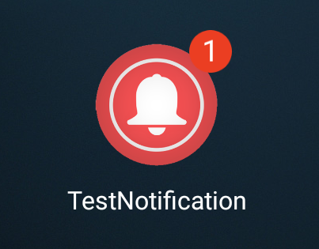
</div>

È stata trovata una libreria molto interessante e facile da applicare, il cui pacchetto prende il nome di **Xamarin.ShortcutBadger**, che è stata applicata nella classe *PushNotificationFirebaseMessagingService*.

Un esempio di codice è il seguente:
```
public override void OnCreate()
{
    base.OnCreate();

    if (ShortcutBadger.IsBadgeCounterSupported(this))
    {
        if (MainActivity.isActivityActive)
            badgeCount = 0;
        else
            badgeCount += 1;

        ShortcutBadger.ApplyCount(this, badgeCount);
    }
}
```

Quello che succede a livello di codice è che il metodo *OnCreate()* viene invocato ad ogni azione che viene eseguita su una notifica (notifica ricevuta, notifica eliminata dall'utente, eccetera...)
__solo__ quando l'attività di *TestNotification* non è nello stato *OnStart*, ovvero nella home del dispositivo, in un'altra applicazione oppure a schermo spento.

Il codice viene eseguito correttamente quando una notifica viene ricevuta, in quanto viene incrementato il contatore del badge, oppure quando l'utente si riporta nell'applicazione *TestNotification*
(invocando il metodo *OnStart()* della classe *MainActivity*). Il problema si genera ogni volta che la notifica viene eliminata manualmente dall'utente quando l'utente non è all'interno 
dell'applicazione, in quanto viene invocato sempre il metodo *OnCreate()* e, per come è stato implementato il codice, viene incrementato erroneamente il contatore del badge.

Lo stagista non ha trovato quindi un metodo che fosse in grado di decrementare il contatore del badge. È stato fatto un tentativo di prova con il metodo *OnDeletedMessages()* della classe
*FirebaseMessagingService*, ma il suddetto metodo viene invocato dal PNS di Firebase solo le notifiche scadono, ovvero non arrivano a destinazione entro il tempo massimo di invio fissato a 28 giorni.

Ergo, il seguente prototipo non implementa correttamente il badge di notifica, per questo viene segnalata come attività futura nel caso l'azienda ritenesse necessaria la sua implementazione. 

> Nota a margine: il classico badge con il pallino rosso è disponibile fino alla versione di Android 7.1. Dalle versioni successive, Android ha implementato un nuovo modo automatico di visualizzazione delle notifiche
chiamato *Notification dot* (consultare il seguente [link](https://developer.android.com/guide/topics/ui/notifiers/notifications#icon-badge)). Queste notifiche hanno la particolarità di essere visibili tenendo
premuta l'icona di partenza per qualche secondo, visualizzando l'ultima notifica e il numero di notifiche ricevute e non ancora lette. Pertanto, l'utilizzo della libreria *ShortcutBadger* è necessaria __solo__
per le versioni di Android antecedenti alla 7.1, compresa quest'ultima.
><div align="center">
>    
></div>

<div align="right"> 

[Torna su](#descrizione-del-prototipo-software-sviluppato)
</div>

### Manuale utente TestNotification

Alla prima apertura dell'applicazione, viene presentata il form di login che offre la possibilità di accedere correttamente al servizio di *TestNotification*.
L'utente, che in questo caso è lo stagista Alberto Gobbo, inserisce le proprie credenziali *Username* e *Password* e poi avvia la procedura di login premendo il pulsante *Login*.

<table width=”auto″ align="center">
    <tr>
        <td valign=”top” width=”30%″>
            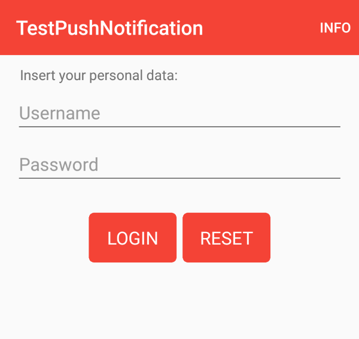
        </td>
        <td valign=”top” width=”30%″>
            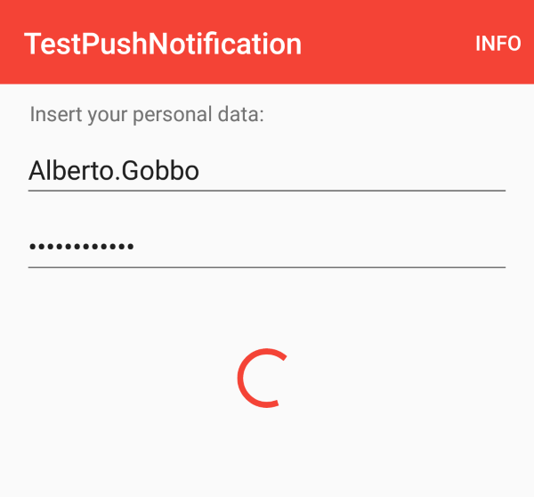
        </td>
    </tr>
</table>

Se le credenziali sono state inserite correttamente, l'utente sarà autenticato e avrà diritto ad accedere alla pagina successiva, che mostra i dati dell'utenza, in particolare lo username appena inserito,
l'azienda e il settore specifico in cui lavora.

<div align="center">
    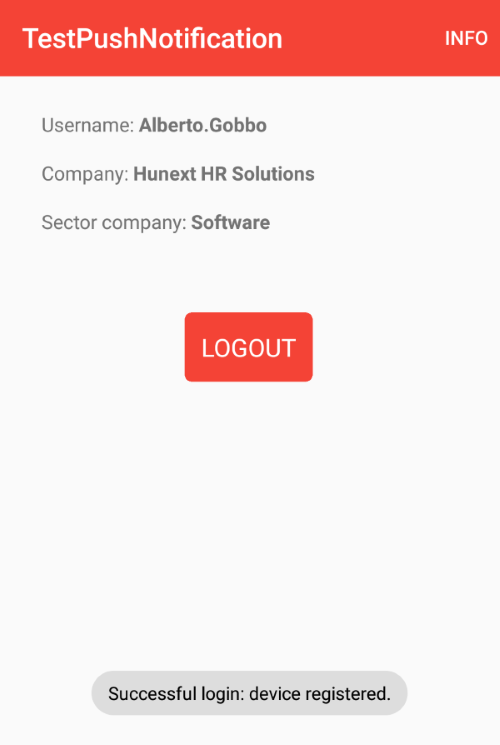
</div>

Ora il dispositivo è abilitato a ricevere qualsiasi notifica, in quanto anche il processo di installazione del dispositivo è andato a buon fine. 
Nel caso reale del contesto aziendale la notifica verrà elaborata ed inviata dal backend, mentre in questo progetto sarà la web application ad avere la responsabilità di invio della notifica.

Ad un certo punto l'utilizzatore della web application decide di inviare una notifica con il seguente testo: "*Hey Alberto! How are things today?*" indirizzato all'utente *Alberto.Gobbo* oppure in modalità broadcast.
Ed è a questo punto che l'applicazione mobile *TestNotification* riceve la suddetta notifica in modalità heads-up, ovvero a comparsa.

<div align="center">
    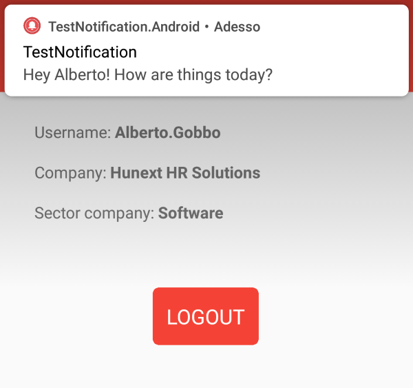
</div>

Se non viene eseguita alcuna azione nella notifica heads-up prima che questa sparisca, allora la notifica viene salvata nella barra di stato.

<div align="center">
    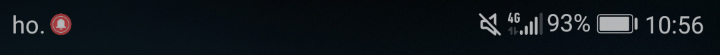
</div>

Se l'utente vuole visualizzare la notifica che ha ricevuto, può fare swipe down dalla barra di stato per visualizzare il centro notifiche. 
Qui troverà la notifica che contiene l'icona dell'applicazione, il titolo del messaggio, il tempo che è passato dalla sua ricezione ed infine il testo del messaggio.

<div align="center">
    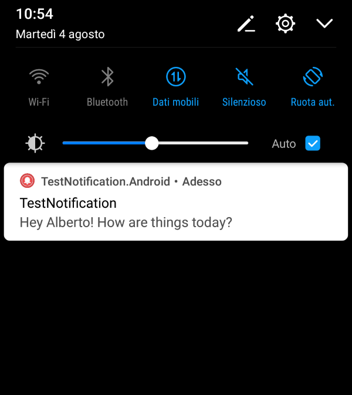
</div>

L'utente può cancellarla dal centro notifiche facendo swipe left/right, oppure selezionarla con un tap in modo da accedere nell'attività corrente dell'applicazione *TestNotification*
(in questo caso la cancellazione della notifica è automatica).

L'utente riceverà notifiche fino a quando non avvia la procedura di logout. Nel caso l'utente decida di disconnettersi dal servizio, allora premerà il pulsante *Logout*.

<div align="center">
    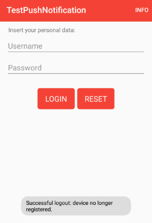
</div>

Se il logout è avvenuto correttamente, allora l'utente non è più autenticato e l'installazione del dispositivo è stata cancellata con successo.
Quindi se l'utilizzatore della web application tenta di inviare una notifica ad *Alberto.Gobbo* oppure in modalità broadcast, l'utente che si è appena disconnesso non riceverà alcuna notifica.

<div align="right"> 

[Torna su](#descrizione-del-prototipo-software-sviluppato)
</div>

### Sviluppo di TestNotification.iOS

Come ampiamente anticipato, l'implementazione per i dispositivi Apple non è stata eseguita. 

Pertanto è dovere dello stagista condividere alcuni link che aiutano lo sviluppatore ad implementare i dettagli della notifica, come del resto fatto in TestNotification.Android per i dispositivi
Android.

La procedura per lo sviluppo di questa parte mancante è disponibile al seguente [link](https://docs.microsoft.com/it-it/azure/developer/mobile-apps/notification-hubs-backend-service-xamarin-forms#configure-the-native-ios-project-for-push-notifications).

<div align="right"> 

[Torna su](#descrizione-del-prototipo-software-sviluppato)
</div>

---

## Sviluppo web application

Il progetto *TestNotificationWebApp* è stato sviluppato a partire da un progetto ASP.NET Core Razor Page. 
Il suo compito principale è quello di inviare la richiesta di notifica al backend che si occupa di elaborare la richiesta per poi inoltrarla all'hub di notifica di Azure, che poi invierà a sua volta la notifica a tutti i PNS disponibili.

La web application non è requisito fondamentale di questo progetto, ma è stata sviluppata per gli utenti che vogliono testare in modo semplice ed intuitivo il funzionamento dell'intero sistema di notifiche, 
evitando l'utilizzo di software più complessi di terze parti.

La sezione è strutturata nelle seguenti sotto-sezioni:
- [Le parti principali del codice TestNotificationWebApp](#le-parti-principali-del-codice-testnotificationwebapp)
- [Manuale utente TestNotificationWebApp](#manuale-utente-testnotificationwebapp)
- [Software alternativo: inviare notifiche con Postman](#software-alternativo-inviare-notifiche-con-postman)

### Le parti principali del codice TestNotificationWebApp

Il primo passaggio essenziale per lo sviluppatore è inserire valori di configurazione localmente utilizzando lo strumento *Secret Manager*. 
Assicurandosi di essere all'interno della cartella *TestNotificationWebApp*, aprire il terminale ed inserire i seguenti comandi:

```
dotnet user-secrets init
dotnet user-secrets set "NotificationHub:Name" <value>
dotnet user-secrets set "NotificationHub:ConnectionString" <value>
```

Il placeholder *\<value\>* va rimpiazzato in questo modo:
- **NotificationHub:Name** è la voce *Name** che si trova in *Informazioni di base* nella pagina principale dell'hub di notifica appena creato.
- **NotificationHub:ConnectionString** è il valore *DefaultFullSharedAccessSignature* copiato nel passaggio 5) della creazione dell'hub di notifica per l'accesso in lettura e scrittura ad Azure.

Il secondo passaggio è creare una classe *Config.cs* che ha il compito di mantenere tutti i valori segreti fuori dal controllo del codice sorgente
Il codice è il seguente:
```
public static partial class Config
{
    public static string BackendServiceEndpoint = "BACKEND_SERVICE_ENDPOINT";
}
```

Il valore *BACKEND_SERVICE_ENDPOINT* verrà sostituito da un'altra nuova classe *Config.local_secrets.cs* che non dovrà mai essere pubblicata in rete (controllare il file .gitignore) e quindi 
rimanere in locale.
Il codice è il seguente:
```
public static partial class Config
{
    static Config()
    {
        // Uncomment ONLY one BackendServiceEndpoint string to start back end

        // Use this string connection if the back end works on Web Service Azure, because it is loaded there 
        //BackendServiceEndpoint = "<your_api_app_url>";

        /* RECOMMENDED FOR DEBUG --> deactivate the firewall completely!
         * 
         * Use this string connection if your back end works on localhost 
         * http(s)://<your-local-ipv4-address>:<service-port>
         */
        //BackendServiceEndpoint = "http(s)://<your-local-ipv4-address>:<service-port>";
    }
}
```

Se il servizio backend è istanziato nell'App Service di Azure, allora de-commentare la riga *BackendServiceEndpoint = "<your_api_app_url>";* e sostituire il placeholder con l'URL dell'App Service 
salvata precedentemente su un file a parte.
Nel caso contrario in cui il servizio backend sia locale, de-commentare la riga *BackendServiceEndpoint = "http(s)://\<your-local-ipv4-address>:\<service-port>";* e sostituire il placeholder con
l'indirizzo locale del nodo nella quale il server è in funzione nella rete interna e la porta per accedere al servizio.

Da questo momento, è importante analizzare le tappe cruciali per la realizzazione del backend. Il progetto è strutturato in questa sequenza:
- *Properties*, la cartella che contiene tutti i parametri per avviare la web application e i file contenenti un riferimento con lo strumento Secret Manager.
- *wwwroot*, la cartella dove risiedono tutti i file statici, ovvero i file .css, .js e le immagini.
- *Configuration*, la cartella dove risiedono i file di configurazione.
- *Models*, la cartella che contiene tutte le classi con la logica di business e di convalida.
- *Pages*, la cartella dove risiedono tutte le pagine web, sia nel formato .cshtml per la formattazione delle pagine HTML che nel formato .cshtml.cs per codificare il comportamento dei vari elementi delle pagine.

Ora l'attenzione passa sulla focalizzazione delle classi più significative di TestNotificationWebApp.

**1) NotificationRequest.cs**

Questa classe contiene i dati che vengono passati all'invio della notifica e rimpiazzano i placeholder nei payload di notifica che si trova nella classe *NotificationRequestTemplate*. 
Nello specifico Text va a sostituire $(textNotification), che sostituirà a sua volta $(alertMessage) nel payload finale della notifica nel backend, mentre Tags va a sostituire $(tagsNotification), che poi nel 
backend verrà elaborato ed inserito come parametro nella chiamata all'API di Azure Notification Hubs che si occupa nello specifico di inviare notifiche con una specifica tagExpression.

**2) NotificationRequestTemplate.cs**

Questa classe contiene la stringa (che può essere serializzata in JSON) che viene inviata come content della richiesta HTTP indirizzata al backend, in particolare all'endpoint *~/api/notifications/requests*.

Ecco il corpo della richiesta:
```
public const string body = "{ \"text\": \"$(textNotification)\", \"tags\": [ \"$(tagsNotification)\" ] }";
```

**3) RegistrationData.cs**

Questa classe contiene i dati principali per quanto riguarda l'insieme delle installazioni dei dispositivi in Azure Notification Hubs.
È stata creata appositamente in quanto è necessaria alla realizzazione della pagina *Information* della web application.

I dati che verranno salvati sono:
- *RegistrationId*
- *Tags*
- *ExpirationTime*

> Per capire il significato di questi dati, andare alla sotto-sezione *Come viene salvata un'installazione specifica in Azure Notification Hubs* della sezione *Approfondimento sul processo di registrazione 
del dispositivo* del documento *3_Descrizione-funzionamento-piattaforme-notifiche-push*.

**4) Index.cshtml.cs**

Questa classe contiene tutta la logica che appartiene alla home page */Index*, contenente un form con i due input che corrispondono ai campi di *NotificationRequest*, ovvero *Text* e *Tags*.

Il campo *Text* corrisponde al testo da inviare nella notifica che va inserito obbligatoriamente, altrimenti il form non fa partire la richiesta.
Il campo *Tags* è un menu a tendina dalla quale scegliere l'utente alla quale inviare la notifica, oppure selezionando la voce predefinita *Everyone* che permette l'invio della notifica in modalità broadcast.
La lista degli utenti viene aggiornata ogni volta che si ricarica la pagina */Index* tramite il metodo *OnGetAsync()*: viene invocata un'apposita chiamata al backend che risponde con un oggetto *UserData* contenente l'id utente (che è
il vero valore da inserire nel campo *Tags* della richiesta) e il corrispondente nome utente (che viene visualizzato nel menu a tendina).

Una volta che i campi sono inseriti correttamente, l'utente può cliccare il pulsante *Send notification* ed invocare *OnPostAsync()*, che è il metodo che si collega al form descritto nel file *Index.cshtml*, in quanto ha *method="post"*. 
Il seguente metodo è stato utilizzato per inviare il content della richiesta HTTP destinata al backend, che ha sostituito i placeholder con il testo e i tag inseriti nel form:

```
string PrepareRequestNotificationPayload(string text, string tag)
{
    if (string.IsNullOrEmpty(tag))
        return NotificationRequestTemplate.body
            .Replace("$(textNotification)", text, StringComparison.InvariantCulture)
            .Replace(" \"$(tagsNotification)\" ", string.Empty, StringComparison.InvariantCulture);
            //.Replace(", \"tags\": [ \"$(tagsNotification)\" ] ", string.Empty, StringComparison.InvariantCulture); --> removing "tags" key, we will obtain the same result of the row above
    else
        return NotificationRequestTemplate.body
            .Replace("$(textNotification)", text, StringComparison.InvariantCulture)
            .Replace("$(tagsNotification)", tag, StringComparison.InvariantCulture);
}
```

Se la notifica è stata inviata con successo, sotto il form verrà stampato un messaggio di avvenuta ricezione.

**5) Information.cshtml.cs**

Questa classe contiene tutta la logica che appartiene alla pagina */Information*, che rappresenta una pagina informativa che ottiene su richiesta i principali dati dall'hub di notifica di Azure inerenti tutte 
le installazioni dei dispositivi. I dati vengono visualizzati sotto forma tabellare e sono gli stessi rappresentati dalla classe *RegistrationData*.

Il metodo *OnGetAsync()* viene chiamato ogni volta che viene richiesta la pagina */Information* e per ottenere le informazioni necessarie contatta l'API di Azure mediante la chiamata 
```await _hub.GetAllRegistrationsAsync(0, CancellationToken.None)```, che ottiene la lista di tutte le installazioni a partire dalla prima tupla presente nell'elenco (ecco il significato del parametro 0).
Ogni tupla viene poi salvata una ad una in *Data*, una lista parametrizzata con la classe *RegistrationData*, ed infine ogni tupla viene stampata come riga della tabella risultante nel codice di *Information.cshtml*.

<div align="right"> 

[Torna su](#descrizione-del-prototipo-software-sviluppato)
</div>

### Manuale utente TestNotificationWebApp

Per avviare la web application *TestNotificationWebApp* è necessario:
- aprire Visual Studio 2019
- fare click destro su *TestNotificationWebApp* e selezionare *Set as Startup Project*.
- dal menu selezionare in sequenza *Debug --> Start Debugging*.
- aprire il file presente nel percorso *TestNotificationWebApp --> Properties --> launchSettings.json*.
- sotto la chiave *TestNotificationWebApp*, copiare uno degli URL presenti nella sotto-chiave *applicationUrl*.
- aprire un browser, incollare l'URL appena copiata nella barra degli indirizzi e premere invio.

In questo progetto, l'URL corrisponde a: *https://localhost:6001/*. L'utente vedrà la home page che contiene il form per l'invio della notifica.

<div align="center">
    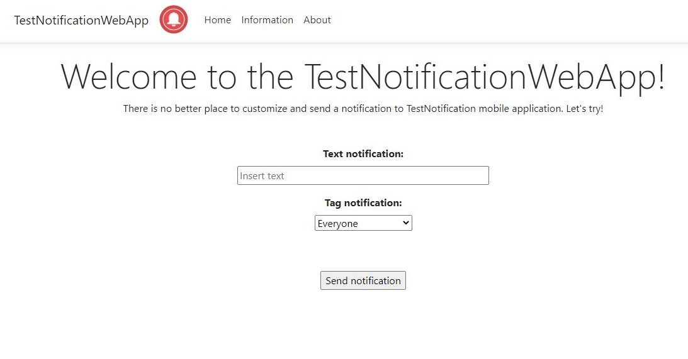
</div>

Il form contiene l'input per il testo sotto la voce **Text notification** e una menu a discesa sotto la voce **Tag notification** che contiene tutti gli utenti alla quale è possibile inviare la 
notifica. La voce di default è impostata a *Everyone*, che consente di inviare la notifica a tutti gli utenti autenticati al servizio di *TestNotification*.

> Attenzione: se l'input **Tag notification** è selezionato a *Everyone*, la notifica non viene inviata a tutti gli utenti che sono presenti nel menu a tendina, in quanto i suddetti sono gli 
> utenti presenti nel database del backend, e non gli utenti che hanno il dispositivo installato nell'hub di notifica di Azure.

<div align="center">
    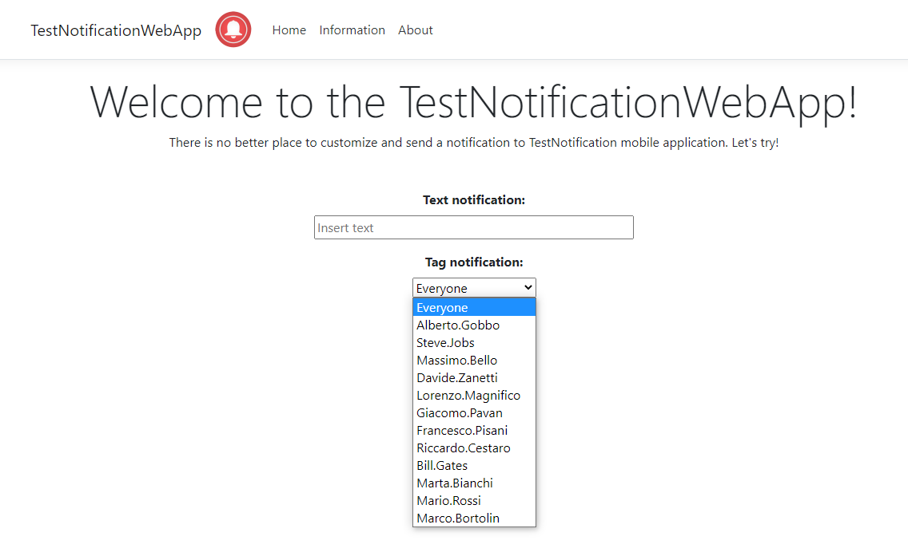
</div>

L'utente vuole inviare una notifica allo stagista Alberto Gobbo, quindi compila l'input **Text notification** con il testo *Hey Alberto? How are things today?* e dal menu a tendina di **Tags 
notification** seleziona la voce *Alberto.Gobbo*.
Alla fine dell'inserimento dei dati, l'utente può cliccare il pulsante *Send notification* e aspettare una risposta dal server che indica l'esito della ricezione della notifica.

<div align="center">
    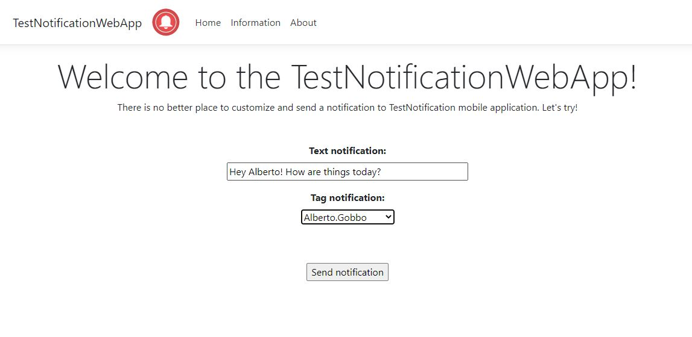
</div>

Se viene ricevuta la notifica dal dispositivo o dai dispositivi nella quale Alberto Gobbo è autenticato, allora la web application riceverà una risposta di avvenuta ricezione che verrà stampata
sotto il form di invio notifica.

<div align="center">
    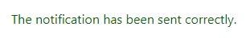
</div>

L'utente vuole verificare quanti dispositivi sono installati in Azure Notification Hubs e quali sono i loro dettagli, quindi sposta il cursore del mouse all'interno della navigation bar e 
seleziona la voce *Information*.

<div align="center">
    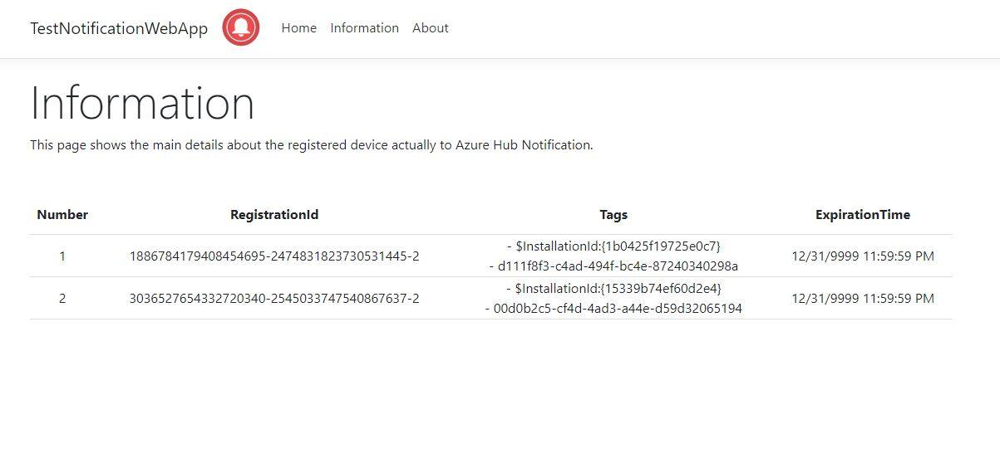
</div>

L'utente può osservare che sono installati due dispositivi (il numero di tuple è visibile dall'ultima riga della colonna **Number**): nel dettaglio, può sapere il **TegistrationID**, i **Tags** ed
infine l'**ExpirationTime** di ogni singolo dispositivo installato.

<div align="right"> 

[Torna su](#descrizione-del-prototipo-software-sviluppato)
</div>

### Software alternativo: inviare notifiche con Postman

Lo stagista ha creato una web application che permette di inviare una notifica da un'interfaccia web semplice, presente nel progetto *TestNotificationWebApp*.

Prima di creare la web application si è cimentato nell'utilizzo di [Postman](https://www.postman.com/), un programma adatto per inoltrare richieste a determinati endpoint indipendentemente dalla posizione del server.

In seguito vengono illustrate le due modalità per l'utilizzo di Postman.

**PRIMA MODALITÁ**

La prima cosa da fare è creare una nuova richiesta, rispettando i seguenti passaggi:
- nella barra in alto, selezionare il metodo **POST** e inserire l'URL relativo all'inoltro della notifica https://serverpushnotification.azurewebsites.net/api/notifications/requests (oppure avviare il back end locale all'indirizzo http://localhost:5000/api/notifications/requests).
- selezionare la voce **Headers** presente nel tab, e:
    - Attivare la checkbox della key **Content-Type** e scrivere come value **application/json**.
- selezionare la voce **Body** presente nel tab, attivare il radio button **raw** e selezionare **JSON** nel menu a tendina. Nella text box sottostante, scrivere il corpo del messaggio di notifica:
```
{
    "text": "Hey man! How are things?"
    "tags": [
        "guid_user",
    ]
}
```
1) Il parametro **text** indica il testo che verrà inserito nella notifica. Il titolo è fissato di default come il nome dell'applicazione corrente.

2) Il parametro **tags** invece indica un insieme di valori che specificano quali device, registrati con i relativi tag, possono essere raggiunti. È possibile inserire 0 tag (che equivale a raggiungere tutti i dispositivi registrati in Azure Hub Notification),
e il numero massimo inseribile è di 10 tag. Questa limitazione è dovuta al fatto che la *tagExpression*, che viene costruita ed elaborata dal back end, è un'operazione logica di soli AND (&&). In merito a questa operazione, la documentazione è chiara, infatti utilizzando solo && 
è possibile inserire al massimo 10 tag.

> Nel caso d'uso specifico di Hunext, il tag da inserire è il GUID al quale si vuole inviare la notifica.
Va evidenziato che, dopo vari tentativi di test, non è possibile inserire più tag diversi all'interno del parametro **tags**.
La best practice da tenere è inviare una notifica per ogni utente, quindi N notifiche per N utenti.

- cliccare il bottone **Send** e inviare la notifica.

**SECONDA MODALITÁ**

Nel caso non si volesse preparare manualmente la richiesta, è possibile scaricare il file con alcune richieste di default che si trova, a partire dalla radice di questo repository, in *Archive/PostmanTestNotificationRequests*.

> In alternativa, è possibile scaricare il suddetto file tramite questo [link](https://drive.google.com/file/d/1oDxEGqBFsqdU1l6WnUaa6LrwBHqt1HEP/view?usp=sharing).

Successivamente, aprire l'applicativo Postman, cliccare il bottone **Import** presente in alto sotto il menu e selezionare il file appena scaricato.

Il file contiene due richieste HTTP avente lo stesso body ed indirizzate al tag dell'utente *Mario.Rossi*. La prima richiesta è indirizzata all'URL del back end locale che dev'essere avviato manualmente, mentre la seconda all'URL dello stesso back end ma caricato su Azure ed accessibile pubblicamente.

**Pre-condizione**: almeno un device deve essere autenticato come *Mario.Rossi*.

**Post-condizione**: una volta che la richiesta HTTP viene inoltrata, tutti i device che sono autenticati come *Mario.Rossi* ricevono una notifica.

> Come descritto nella issue [#8](https://github.com/HunextSoftware/TestNotification/issues/8), l'invio della notifica comporta una risposta HTTP 422 (lo si può sia visualizzare da Postman che dalla console 
della web application). Questo errore semantico è dovuto al fatto che è stato configurata la piattaforma FCM ma non APNS, infatti il codice backend è già predisposto per l'invio di notifiche a dispositivi Apple.
È stato testato che, rimuovendo il codice specifico di TestNotification.Backend in Model/PushTemplates e Services/NotificationHubsService, l'invio della notifica comporta una risposta HTTP 200, con avvenuta 
ricezione della notifica. Ergo, questo problema verrà risolto non appena verrà ultimata la configurazione dell'APN, con il codice backend che deve rimanere intatto.

<div align="right">

[Torna su](#descrizione-del-prototipo-software-sviluppato)
</div>